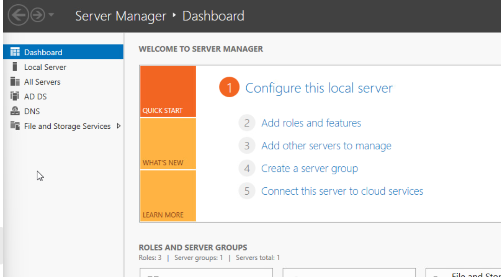

## Downloading ISO and creatting the VM
we need to download the iso into the sorage of the VMware esxi:


Now we need create the vm as shown below:


Make suer that the iso is connected to the CD/DVD adapter:


## Settingup the server
Following the steps for setting up the server


Select the Desktop Experience to have gui experience:


When you get to a page to enter your new password for the administrator account,** do not enter a new password**, just press **Ctrl + shift + f3**, and you will be led to sysprep audit mode


*   Open up a PowerShell as admin and use the following command:
```
    sconfig
    5
    M
	9
```
and change the time zone to Eastern Time (US & Canada), after that check for updates:


Now you need to install the VMware tools:


In the server go to DVD and click on setup:


Go with setup until you see this page:


Now we need to use a script that was created by gmcyber, I used the following command to install the secript:
```
wget https://raw.githubusercontent.com/gmcyber/RangeControl/main/src/scripts/base-vms/windows/windows-prep.ps1 -Outfile windows-prep.ps1
notepad .\windows.ps1
```


When you opened the script in the notpad do the follwoing:
*   Remove the # from lines **7, 8, 9,** and **10** 
*   Add a # in front of lines **14** and **15**
*   Save and exit notepad


After that run the following command in powershell: 
```
Unblock-file .\windows.ps1
Set-ExecutionPolicy RemoteSigned
.\windows.ps1
```


Now after it got reboot copy 13 from the script and paste it in powershell:


when the server is powered off take out the IOS and from the CD adapter and take a snapshot:


## Domain Contorller
First we need to change the hostname (DC1) after the will restart and ask you to set a password to the administrator, to do that I ran the following command:
`Rename-Computer -NewName "DC1" -DomainCredential Domain01\deployer -Restart`


Now we need ser the ip addresses to do that do the following: go to **Netwrok & Internet Settings** → **Ethernet** → **Change adapter options** →  right click on **Ethernet0** and **Properties** → **Internet Protocol Version 4 (TCP/IPv4)** → **Properties**


Now add the ip addresses that were assign to you:


Here are the final result:


## ADDS 
Now we need to install the Active Directory Domain Service to do that I ran the following command:
`Add-WindowsFeature AD-Domain-Services`


After that I created a domain name services in my case was Hasan.local:
`Install-ADDSForest -DomainName Hasan.local -InstallDNS` after it will ask you to enter a password do so:


Now the system will restart and when it is on please login with your domain name that you created:


Now you have to create a user admin, I used the following command for that reason:
```
New-ADUser -Name Hashim-admin -AccountPassword(Read-Host -AsSecureString "InputPassword") | Enable-ADAccount
Add-ADGroupMember -Identity "Domain Admins" -Members Hasan-admin
```
I already created that user that's why you see the error in red below:


## DNS
Now we need to set up forward (**A** records) and reverse (**PTR** records) DNS mappings in a Windows Server environment, allowing hostnames to be resolved to IP addresses and vice versa within the specified domains. to do that I used the following commands:
```
Add-DnsServerPrimaryZone -NetworkID 10.0.17.0/24 -ZoneFile “10.0.17.4.in-addr.arpa.dns”

Add-DnsServerResourceRecordA -Name "vcenter" -ZoneName "Hasan.local" -AllowUpdateAny -IPv4Address "10.0.17.3" 
Add-DnsServerResourceRecordPtr -Name "vcenter" -ZoneName "17.0.10.in-addr.arpa" -AllowUpdateAny -PtrDomainName "Hasan.local"

Add-DnsServerResourceRecordA -Name "480-fw" -ZoneName "Hasan.local" -AllowUpdateAny -IPv4Address "10.0.17.2" 
Add-DnsServerResourceRecordPtr -Name "480-fw" -ZoneName "17.0.10.in-addr.arpa" -AllowUpdateAny -PtrDomainName "Hasan.local"

Add-DnsServerResourceRecordA -Name "xubuntu-wan" -ZoneName "Hasan.local" -AllowUpdateAny -IPv4Address "10.0.17.100" 
Add-DnsServerResourceRecordPtr -Name "xubuntu-wan" -ZoneName "17.0.10.in-addr.arpa" -AllowUpdateAny -PtrDomainName "Hasan.local"

Add-DnsServerResourceRecordPtr -Name "dc1" -ZoneName "17.0.10.in-addr.arpa" -AllowUpdateAny -PtrDomainName "Hasan.local"

Get-DnsServerResourceRecord -ZoneName Hasan.local -RRType A | Format-Table
Get-DnsServerResourceRecord -ZoneName 17.0.10.in-addr.arpa -RRType PTR | Format-Table
```


## Remote Desktop and DHCP
We need to enable remote desktop to do that I did the following:
Go to **Control Panel → System and Security → System → Advanced system settings → Remote** and select the option to **Allow remote connections to this computer.** after that click on Apply and OK:


## Install DHCP Server Role
Now we need to install the DHCP server to do that we have to login as Administrator:

1. Open Server Manager: Click on the Start button and select Server Manager.

2. Add Roles and Features: In the Server Manager dashboard, click on "Add Roles and Features".


3. Role-based or feature-based installation: Choose "Role-based or feature-based installation" and click Next.

4. Select destination server: Choose the server on which you want to install the DHCP role and click Next.

5. Select server roles: Check the box next to "DHCP Server" in the list of roles. When prompted to add features that are required for DHCP Server, click Add Features, then click Next.

6. Continue through the wizard**: Proceed through the wizard, accepting default selections until you reach the "Confirm installation selections" page.

7. Install: Click Install. After the installation is complete, you might need to complete the DHCP Post-Install configuration wizard by defining an authorized user.

<!--StartFragment-->

## Authorize DHCP Server in Active Directory

1.  **Open DHCP**: From the Start Menu, open DHCP by typing "dhcp" and selecting the DHCP app.


2.  **Authorize DHCP Server**: In the DHCP console, right-click the server name and select "Authorize". Wait a moment, then right-click again and select "Refresh" to see the authorization status.


## Configure DHCP Scope
1.  **Open DHCP Console**: If not already open, navigate to the DHCP console as described above.

2.  **Create New Scope**: Right-click on the server name and choose "New Scope". The New Scope Wizard opens.

3.  **Follow the New Scope Wizard**: Enter the name ("480 Network") and description for the scope. Specify the start and end IP addresses (10.0.17.101 to 10.0.17.150) and subnet mask (255.255.255.0). Proceed through the wizard, setting up any additional options as required, like router (default gateway), domain name, and DNS servers.

    *   For Router (default gateway), enter `10.0.17.2`.
    *   For DNS servers, enter `10.0.17.4`.
    *   For Domain name, enter `Hasan.local`.


