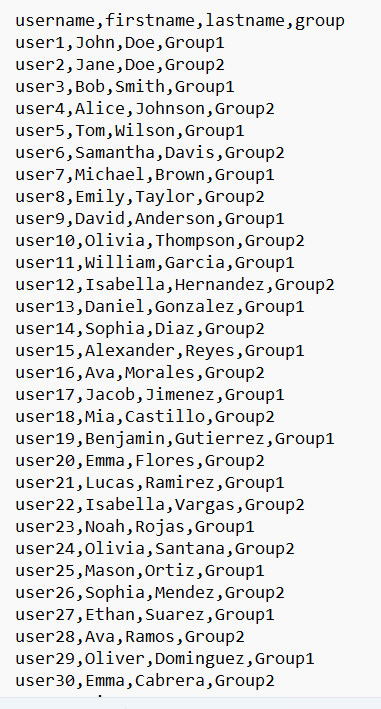
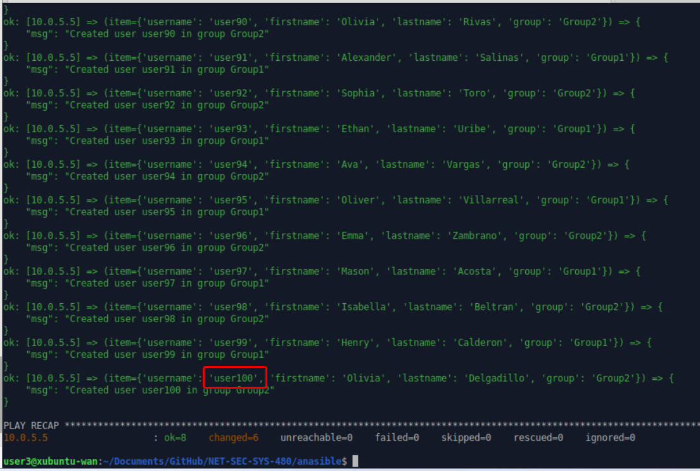
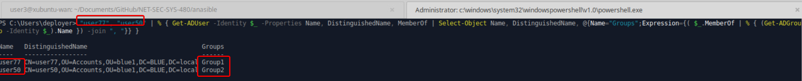

# Milestone 10 - Domain Provisioning

First thing you need to genrate a 100 users and two groups in my case. I used ChatGPT for that:
Which will be found here: [Users.csv](./Users.csv)



Next I created a play book that does the following:

*   `admin_password`: Retrieved from the environment variables, this is used to authenticate operations that require elevated privileges.
*   `local_csv_path`: The path to the CSV file on the local machine which contains the user data.
*   `remote_csv_path`: The path where the CSV file will be stored on the remote machine.

**Tasks:**

1.  **Upload CSV File to Windows Host**

    *   **Description**: Copies the CSV file from the local machine to the specified path on the remote Windows host.
    *   **Module**: `win_copy`

2.  **Ensure NuGet Provider is Available**

    *   **Description**: Checks if the NuGet provider is available and installs it if absent. It also sets the PSGallery repository as trusted to avoid prompts during module installation.
    *   **Module**: `win_shell`

3.  **Install Necessary PowerShell Modules**

    *   **Description**: Installs the `ImportExcel` PowerShell module, which is necessary to read Excel and CSV files on the remote host.
    *   **Module**: `win_shell`

4.  **Read User Data from CSV and Output as JSON**

    *   **Description**: Converts the data from the uploaded CSV file into JSON format for easier manipulation in later tasks.
    *   **Module**: `win_shell`
    *   **Registers**: Stores the output in `csv_data` for use in subsequent tasks.

5.  **Ensure Groups Exist**

    *   **Description**: Checks if the specified AD groups exist and creates them if they do not. This is necessary before adding users to these groups.
    *   **Module**: `win_shell`
    *   **Loop**: Iterates over the user data parsed from the CSV.

6.  **Create Users and Assign to Their Group**

    *   **Description**: Creates a new user for each entry in the CSV file with a secure password and adds the user to their respective group.
    *   **Module**: `win_shell`
    *   **Loop**: Iterates over each user and group combination as derived from the CSV file.

7.  **Debug User Creation Output**

    *   **Description**: Outputs a debug message for each user created, providing a clear log of which users were added and their assigned groups.
    *   **Module**: `debug`
    *   **Loop**: Again iterates over the JSON data for each user.

```
- hosts: 10.0.5.5
  vars:
    admin_password: "{{ lookup('env','ADMIN_PASSWORD') }}"
    local_csv_path: "./users.csv"
    remote_csv_path: "C:\\Users\\deployer\\Documents\\users.csv"

  tasks:
    - name: Upload CSV file to Windows host
      win_copy:
        src: "{{ local_csv_path }}"
        dest: "{{ remote_csv_path }}"

    - name: Ensure NuGet provider is available
      win_shell: |
        if (-not (Get-PackageProvider -Name NuGet -ListAvailable -ErrorAction SilentlyContinue)) {
            Install-PackageProvider -Name NuGet -MinimumVersion 2.8.5.201 -Force
        }
        Set-PSRepository -Name PSGallery -InstallationPolicy Trusted

    - name: Install necessary PowerShell modules
      win_shell: |
        Install-Module -Name ImportExcel -Force -Confirm:$false

    - name: Read user data from CSV and output as JSON
      win_shell: |
        $data = Import-Csv -Path "{{ remote_csv_path }}"
        $data | ConvertTo-Json
      register: csv_data

    - name: Ensure groups exist
      win_shell: |
        $group = "{{ item.group }}"
        if (-not (Get-ADGroup -Filter "Name -eq '$group'")) {
            New-ADGroup -Name $group -GroupScope Global -Path "OU=Groups,OU=blue1,DC=BLUE,DC=local"
        }
      with_items: "{{ (csv_data.stdout | from_json) }}"
      loop_control:
        loop_var: item

    - name: Create users and assign to their group
      win_shell: |
        $username = '{{ item.username }}'
        $password = '{{ lookup("password", "/tmp/ansible_secure_passwords length=15 chars=ascii_letters,digits,specialchars=punct") }}'
        $securePassword = ConvertTo-SecureString -String $password -AsPlainText -Force
        New-ADUser -Name $username -AccountPassword $securePassword -Enabled $true -Path "OU=Accounts,OU=blue1,DC=BLUE,DC=local"
        Add-ADGroupMember -Identity '{{ item.group }}' -Members $username
      loop: "{{ csv_data.stdout | from_json }}"
      when: csv_data.stdout is defined

    - name: Debug user creation output
      debug:
        msg: "Created user {{ item.username }} in group {{ item.group }}"
      loop: "{{ csv_data.stdout | from_json }}"
      when: csv_data.stdout is defined

```

After it is done you should see no error:



To test that need to ssh to one of domain admins users, in my case "deployer" and run the following command:

`"user77", "user50" | % { Get-ADUser -Identity $_ -Properties Name, DistinguishedName, MemberOf | Select-Object Name, DistinguishedName, @{Name="Groups";Expression={( $_.MemberOf | % { (Get-ADGrou
p -Identity $_).Name }) -join ", "}} }`


