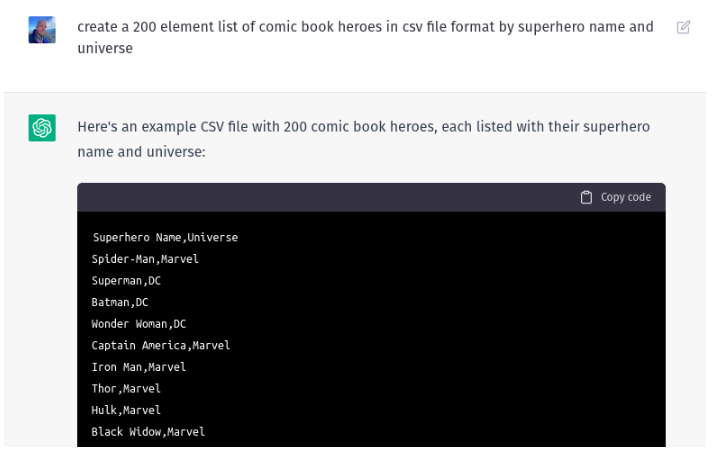

# Milestone 10 - Domain Provisioning

## 10.1 Users and Groups
Build a CSV file of at least 100 users.  There should also be at least two groups..  It turns out that ChatGPT is pretty good at creating test data.  In this case, I have User Name and Group (Universe).  Use an example other than this one.

Build an Ansible Playbook that 
*   Creates a group for each unique group in the CSV file and places that group in the groups OU created in milestone 9.
*   Creates a domain User and assigns that User to the appropriate group with a Random and Secure Password.

  There are a few ways to handle this.  One could preprocess the CSV file, creating a separate groups file and accounts file, augmenting it with a strong password field or do this on the fly.  You will need to somehow capture the password so that you can login during your test.  You may pretend that the user's password is emailed to them (this is precisely what is done on cyber.local each semester).  Be sure to drop the users in the custom accounts OU and the groups in the accounts/groups OU.  Safeguard any credential material by saving it outside your repository path and/or by vaulting it.

**[10.1 Instructor Demonstration](https://drive.google.com/file/d/1i45I3HCHPVPUc4hOcjcOiBhXd0qcWy_6/view?usp=sharing)**

<!--StartFragment-->

### 10.2 File Services
Deploy a Server 2019, GUI or Server Core File ServerCreate a playbook that
*   Has a static IP address (pick one)
*   Joins it to the domain
*   Create a file share for each group from above and allow read/write permissions to the appropriate groups in Active Directory.
*   Create a Group Policy Such that members of each group have mapped drives that point to their groups file share

### 10.3 Windows 10
Deploy a Windows 10 Workstation
Create a playbook that
*   Has a DHCP IP address
*   Joins the workstation to the Domain
