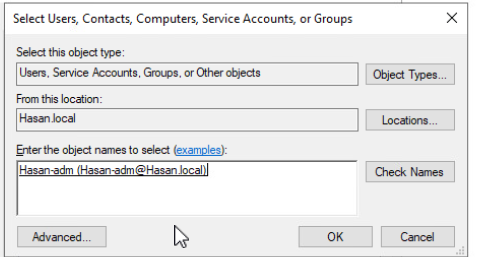
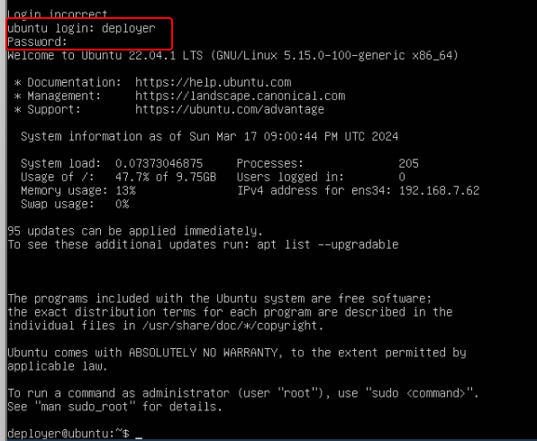

## Milestone 4.1 Active Directory LDAPs SSO Provider
I Install ADCS Certificate Authority via Powershell using the following command:

```
Install-WindowsFeature ADCS-Cert-Authority -IncludeManagementTools
Install-AdcsCertificationAuthority -CACommonName "sean-DC1-CA" -CAType EnterpriseRootCa -CryptoProviderName "RSA#Microsoft Software Key Storage Provider" -KeyLength 2048 -credential (get-credential) -HashAlgorithmName SHA512
```


Now I wrote a script below and ran it to download the ADCS:
```
$c = Get-Credential
Install-AdcsCertificationAuthority -CAType EnterpriseRootCa
	-CAType EnterpriseRootCa 1
	-CACommonName dc1-Cert
	-Credential $c
	-CryptoProviderName "ECDSA_P256#Microsoft Software Key Storage Provider"
	-KeyLength 256
	-HashAlgorithmName SHA256
	-ValidityPeriod Years
	-ValidityPeriodUnits 3
```


fix- as shown below:

click on Yes to All and it will reboot:


After the reboot proces go to Certification Authority if everything works correctly you should see Hasan-DC1-CA as shown below:


go to vsphere, click on the menu button in the top-left-hand corner, and click on administration


In Administration, scroll down to **Single Sign On,** select **configuration**, and click **Active Directory Domain** and finaly click on **JOIN AD**


Fill the following and cick on JOIN:


If everything worked you should see this: 


Now orgnization using Organizational Unit:

*   Go back to dc1, go to server manager
*   Click on AD DS, right click on dc1, and select Active Directory Users and Computers, right click Hasan.local, click new, click Organizational Unit, name the OU "480", click ok


Do the same but inside 480 and name it Accounts:


do the same inside Accounts and name it ServiceAccounts:


Right click on **ServiceAccounts** and then click **new**, click us****er, configure it to look like the image below


I ran the following command in the xubunt-wan:
`openssl s_client -connect dc1.Hasan.local:636 -showcerts </dev/null 2>/dev/null | openssl x509 > cert.pem`



* in vsphere (xubunt-wan) click on the menu button in the top-left-hand corner, click **administration**
*   In **Administration**, scroll down to **Single Sign On**, select **configuration**, and click **Identity Source**, click add
      * Identity Source Type: **Active Directory over LDAP**
* Fill it out:


If you see this means it worked:


 on **Single Sign On** click on **Users and Groups** and **Groups**. Edit the **Administrators** group and add **vcenter-adm** group:
 


If it worked then you should be able to login as your domain as shown below:


## Milestone 4.2 Powershell, PowerCLI and Our First Clone
Get xubuntu-wan ready and isntall ansible as shown below:

```
sudo apt install sshpass python3-paramiko git
sudo apt-add-repository ppa:ansible/ansible
sudo apt update
sudo apt install ansible
ansible --version
```


don't forget to run the below commands:
```
cat >> ~/.ansible.cfg << EOF


                         
[defaults]
host_key_checking = false
EOF
```


Now we need to isntall powerhsell in the xubuntu to be able to clone the VMs:

```
sudo snap install powershell --classic
pwsh
Write-Host $PSVersionTable
```


Below are the PowerCLI libraries:
```
Install-Module VMware.PowerCLI -Scope CurrentUser
Get-Module VMware.PowerCLI -ListAvailable
Set-PowerCLIConfiguration -InvalidCertificateAction Ignore
Set-PowerCLIConfiguration -Scope User -ParticipateInCEIP $false
```


to connect to the system we need to use the following command:

`Connect-VIServer -Server "vcenter.hasan.local"`
`Get-Vm`


To manage and utilize virtual machine (VM) snapshots and storage efficiently, start by retrieving the VM named "dc1" and its "Base" snapshot using `$vm = Get-VM -Name dc1` and `$snapshot = Get-Snapshot -VM $vm -Name "Base"`. For host and datastore details, use `$vmhost = Get-VMHost -Name "192.168.7.20"` and `$ds = Get-DataStore -Name "datastore1"`. To prepare for linked clone creation, which optimizes storage by sharing disks with the parent VM, define a linked clone name with `$linkedClone = "{0}.linked" -f $vm.name`, facilitating easy identification and management of linked clones in a VMware environment.

```
$vm = Get-VM -Name dc1
$snapshot = Get-Snapshot -VM $vm -Name "Base"
$vmhost = Get-VMHost -Name "192.168.7.20"
$ds = Get-DataStore -Name "datastore1"
$linkedClone = "{0}.linked" -f $vm.name
$linkedClone
```


Crafting a linked clone from an existing VM snapshot using `$linkedVM = New-VM -LinkedClone -Name $linkedClone -VM $vm -ReferenceSnapshot $snapshot -VMHost $vmhost -Datastore $ds`, which conserves resources by sharing disks. Subsequently, generate a new VM named "server.2019.gui.base" from the linked clone with `$newvm = New-VM -Name "server.2019.gui.base" -VM $linkedVM -VMHost $vmhost -Datastore $ds`, and immediately create a baseline snapshot for this new VM using `$newvm | New-Snapshot -Name "Base"`. After these operations, clean up by removing the linked VM with `$linkedvm | Remove-VM` to maintain a tidy and efficient virtual environment.

```
$linkedVM = New-VM -LinkedClone -Name $linkedClone -VM $vm -ReferenceSnapshot $snapshot -VMHost $vmhost -Datastore $ds
$newvm = New-VM -Name "server.2019.gui.base" -VM $linkedVM -VMHost $vmhost -Datastore $ds
$newvm | New-Snapshot -Name "Base"
$linkedvm | Remove-VM
```


I created a script for cloning the VMs, this script started with a funcation called `cloneMyVM`. The `cloneMyVM` function streamlines the process of creating new virtual machines (VMs) from snapshots, enhancing efficiency in virtual environments. Upon invocation, it logs the source VM, snapshot used, and the name for the new VM, providing clear feedback. It leverages `Get-VM` and `Get-Snapshot` to identify the original VM and its specific snapshot, respectively, and then specifies the host and datastore. The function creates a linked clone to conserve resources and then generates a new VM with a base naming convention from this clone. Post-creation, it captures a "Base" snapshot for the new VM and cleans up by removing the temporary linked VM, ensuring a streamlined cloning process. This approach is exemplified in creating new firewall and Ubuntu VMs, demonstrating versatility and efficiency in managing virtual resources.

To access the script use the following link: https://github.com/hasanhashim1/NET-SEC-SYS-480/blob/main/cloner.ps1

Blow are the reslut after running the script:


in vsphere click on the menu bars in the top left-hand corner and select **inventory**. Right click on **480-DevOps-DataCenter**, select **new folder**, call it **PROD** and create another folder call it **BASEVM**:
Add the bases vms in the **BASEVM** and the rest in the **PROD**:


## Milestone 4.3 Ubuntu Server Base VM and Linked Clone
Here is the link to download the iso image of the iso image that we goin to use for this part https://old-releases.ubuntu.com/releases/22.04.1/

After downloding the iso add to the esxi datastore as shown below:


Now create a VM and add the iso in the CD and do the hardware configuration as shown below:


Now start the vm and start configureing it:


the rest of the configuration is the default so I'm not going to go over every step. setup your profile as shown below:


after rebooting login using the profile that you created in my case it is **depler**



Downloading a script to praper the vm for the base using the following command:
```
sudo -i
wget https://raw.githubusercontent.com/gmcyber/RangeControl/main/src/scripts/base-vms/ubuntu-server.sh

chmod +x ubuntu-server.sh
./ubuntu-server.sh
shutdown
```


Take a snapshot name it Base:


Now we going to use the scrept we did and make a clone of the ubuntu Base:


## Reflection
This milestone revolved around integrating vCenter with Active Directory (AD) for streamlined login processes, harnessing the power of PowerShell and PowerCLI on a Xubuntu-WAN environment, and masterfully extracting and cloning virtual machines (VMs) to establish a robust and efficient virtual infrastructure. The initial phase of the project involved setting up an AD Certificate Authority, a critical step that required careful attention to detail and an understanding of PowerShell commands. This foundational work was crucial for securing the communication between vCenter and the Active Directory, ensuring that only authorized users could access the system.