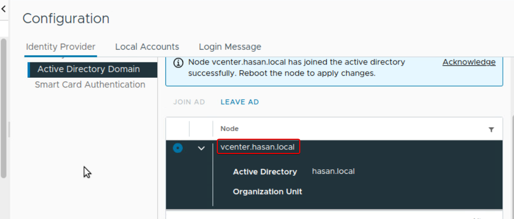

## Milestone 4.1 Active Directory LDAPs SSO Provider





## Milestone 4.2 Powershell, PowerCLI and Our First Clone
```
sudo apt install sshpass python3-paramiko git
sudo apt-add-repository ppa:ansible/ansible
sudo apt update
sudo apt install ansible
ansible --version
```

```
cat >> ~/.ansible.cfg << EOF


                         
[defaults]
host_key_checking = false
EOF
```


```
sudo snap install powershell --classic
pwsh
Write-Host $PSVersionTable
```


```
Install-Module VMware.PowerCLI -Scope CurrentUser
Get-Module VMware.PowerCLI -ListAvailable
Set-PowerCLIConfiguration -InvalidCertificateAction Ignore
Set-PowerCLIConfiguration -Scope User -ParticipateInCEIP $false
```


`Connect-VIServer -Server "vcenter.hasan.local"`
`Get-Vm`


## Milestone 4.3 Ubuntu Server Base VM and Linked Clone

still working on it


