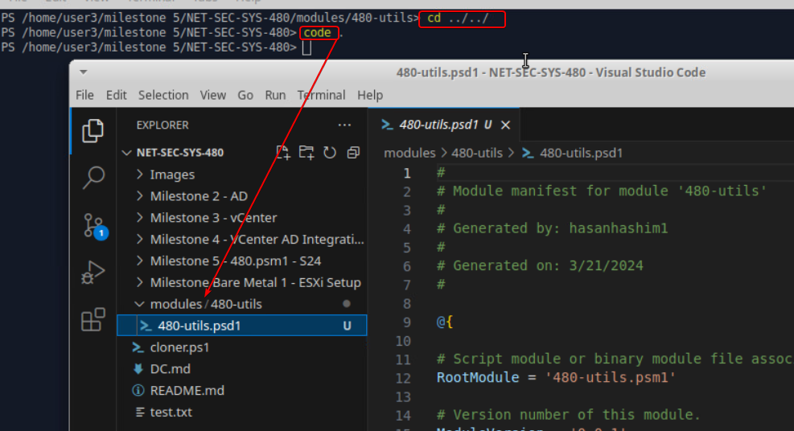

# Milestone 5 480.psm1

## Requirements for Milestone 5

- License vCenter and vSphere/ESXi using provided instructions.
- Install Visual Studio Code (VSCode) on Xubuntu-WAN along with the PowerShell extension.
- Build a module skeleton as described in the provided resource.
- Improve upon or implement functions demonstrated in previous milestones.
- Add functions to your `480Utils.psm1` module to:
  - Create a linked or full clone.
  - Gather parameters interactively or via a configuration file.
  - Handle errors gracefully.
 
## Solutions
After getting the License you need to go the vcneter → click on the menue → Administration:


Click on Licenses → ADD, 


add the key and hit next:


### Visual Studio Code (VSCode) on Xubuntu-WAN 
* Now we are going to install VSCode on xubuntu to do that use the command below:

```
pwsh
sudo snap install code --classic
```

* Now we are going to need to isntall git and connect it to our github repo: Below are the command I used:
  ```
	pwsh
	sudo apt install git
	git config --global user.name "your_name"
	git config --global user.email "email@address.com"
	git config --list
  ```
  if you are facing some issues use the following resourse to help you out:
  ```
  https://phoenixnap.com/kb/how-to-install-git-on-ubuntu
  https://www.geeksforgeeks.org/how-to-install-configure-and-use-git-on-ubuntu/
  ```

* Now are going to install GIT Desktop, use th following command for that:
```
sudo wget https://github.com/shiftkey/desktop/releases/download/release-3.1.1-linux1/GitHubDesktop-linux-3.1.1-linux1.deb
ls
sudo dpkg -i GitHubDesktop-linux-3.1.1-linux1.deb
```

* We will create a folder called modules and files that reqired for this lab:

I started by creating a new directory named `modules` to organize my PowerShell scripts, and then I moved into this directory. Next, I set up a subdirectory specifically for my new project, calling it `480-utils`, which is meant for a vSphere automation module I’m developing for a course called NET-SEC-SYS-480. Inside this subdirectory, I created a module manifest with `New-ModuleManifest`, specifying my name as the author and 'Hashim Tech' as the company name. This manifest file, `480-utils.psd1`, also includes a brief description of the module's purpose.

After creating the manifest, I checked the contents of the directory to ensure everything was in place, and then I created an empty PowerShell script module file named `480-utils.psm1` to start writing my module's functions. Finally, I navigated back to the root of my course project directory, `NET-SEC-SYS-480`, and opened the entire directory in Visual Studio Code to begin coding.
```
mkdir modules
mkdir 480-utils
New-ModuleManifest -Path .\480-utils.psd1 -Author 'hasanhashim1' -CompanyName 'Hashim Tech' -RootModule '480-utils.psm1' -Description 'vsphere automation module for NET-SEC-SYS-480'
touch 480-utils.psm1
cd ../../ 
code .
```




Inside the Visual Studio Code editor, you will see your project structure on the left, with the newly created `480-utils.psd1` and `480-utils.psm1` files visible under the `modules/480-utils` directory. I've just penned my first function in the `.psm1` file, named `480SEC()`, which outputs a friendly greeting: "Hello from Hasan to anyone on SYS480". This function is the start of my automation scripts that I plan to develop as part of the DevSecOps curriculum.


Now run the following commands:
```
    cd modules
    code $profile
	$env:PSModulePath = $env:PSModulePath + ":<!--StartFragment--:/home/user3/milestone 5/NET-SEC-SYS-480/modules"
```


to test it run the following command in the termnal:
```
$env:PSModulePath
Import-Module '480-utils' -Force
480SEC
```


Now add the following code to connect to the vcenter server:
```
function 480Connect([string] $server){
    $conn = $global:DefaultVIServer
    #are we already connected
    if ($conn){
        $msg = 'Already Connected to: {0}' -f $conn

        Write-Host -ForegroundColor Green $msg
    }
    else{
        $conn = Connect-VIServer -Server $server
        #if this fails, let Connect-VIServer handle the encryption
    }
}
```
After adding the code above save it and run it as shown below:


Now I'm going to create a new PowerShell script and associated JSON configuration file to help automate tasks with vSphere. First, in Visual Studio Code, I created two new files, `480driver.ps1` for the script and `480.json` for the JSON configuration.

In `480driver.ps1`, I made sure to import the custom module `480-utils` that I had been working on by using the `Import-Module` command with the `-Force` parameter to ensure the latest version is loaded. I called a function `480SEC`, which is a function within the `480-utils` module that displays the message.
```
touch 480driver.ps1
touch 480.json
```
Then, I opened the `480.json` file and populated it with JSON content that specifies the vCenter server address. This configuration will be used by the script to connect to the vCenter server.
```
{
    "vcenter_server" : "vcenter.hasan.local"
}
```


After that, I expanded the `480-utils.psm1` module script by adding a new function `Get-480Config`, which reads a configuration path, checks if the path is valid, and then converts the content from JSON to a PowerShell object. This function is critical for my script as it dynamically retrieves connection settings.
```
function Get-480Config([string] $config_path){
    Write-Host "Reading " $config_path
    $conf = $null
    if (Test-Path $config_path){
        $conf = (Get-Content -Raw -Path $config_path | ConvertFrom-Json)
        $msg = "Using configuration at {0}" -f $config_path
        Write-Host -ForegroundColor Green $msg
    }
    else{
        Write-Host -ForegroundColor "Green" "No Configurtion"
    }
    return $conf
}
```


With the new function added to the module, I went back to the integrated terminal in Visual Studio Code to import the `480-utils` module again and executed `Get-480Config` to load the configuration settings from `480.json`. The output of `$conf` would confirm the contents of the configuration, and `pwd` would show the current directory, just to maintain context.

```
Import-Module '480-utils' -Force
$conf=Get-480Config -config_path "./480.json
pwd
```


Finally, I switched to `480driver.ps1` to write the script logic that fetches the configuration using the `Get-480Config` function and then connects to the vCenter server with these settings by calling `480Connect` and passing the server address from the configuration.

Back in the terminal, I ran `./480driver.ps1` to execute the script, which would use the configuration to establish a connection to the vCenter server defined in the JSON file.

Now we going to add another function called Select-VM:
```
function Select-VM([string] $folder){
    $selected_vm=$null
    try{
        $vms = Get-VM -Location $folder
        $index =1
        foreach($vm in $vms){
            Write-Host [$index] $vm.name
            $index+=1
        }
        $pick_index = Read-Host "Which index number [x] do you wish to pick?"
        #480-TODO need to deal with an invalid index (consider making this check a function)
        $selected_vm = $vms[$pick_index -1]
        Write-Host "You picked " $selected_vm.name
        #note this is a full on vm object that we can interact with
        return $selected_vm
    }

    catch{
        Write-Host "Invalid Folder: $folder" -ForegroundColor "Red"
    }
}
```


add the following code in the .json file:
```
"vm_folder" : "BASEVM"
```


Run it to test it:


You will find the full code in my github.


