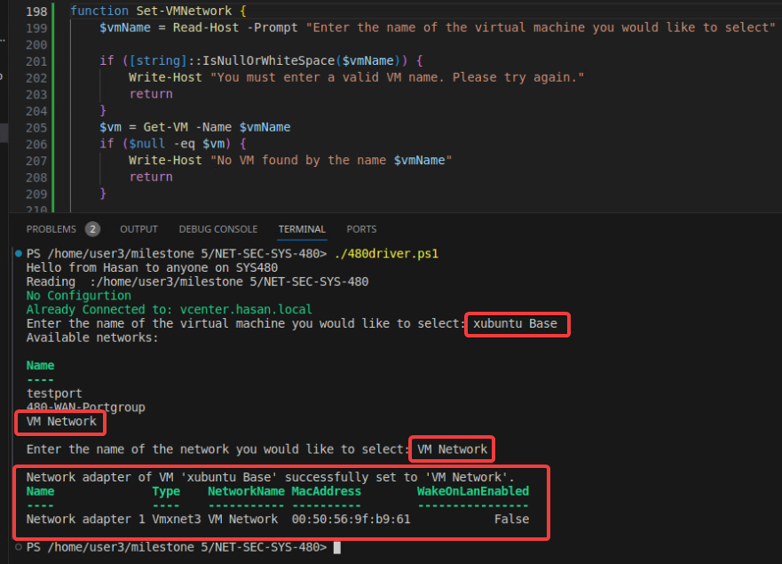

# Milestone 6 - Blue Network and vyos Provisioning with Ansible
The intersection between Virtual Machine Automation and Physical Networking is interesting.  How do you provision a system that is meant to be on another network?  We will use a combination of PowerCLI to control the network the virtual machines are on and Ansible to adjust the actual virtual machine OS settings.  Automating the vyos router is not an easy task to start with but it is the logical one before we configure the Blue network

## [Milestone Overview ](https://drive.google.com/file/d/1mMvZrhSKvflSqiJU_1OPigh2S7P1vMdK/view?usp=sharing)
## 6.1 BlueX Networking
*   Requirements
*   *   Extend 480-utils.psm1 to 
    *   *   Add a new function (e.g. called New-Network) that creates a Virtual Switch and Portgroup
        *   *   Tips on helpful PowerCLI commands
            *   *   New-Virtual-Switch
                *   New- VirtualPortGroup
                *   Get-VirtualSwitch…
        *   Add a new function (e.g. called Get-IP) to get the IP, vm name and MAC address from the first interface of a named VM.
        *   *   Tips on helpful PowerCLI commands
            *   *   Get-NetworkAdapter can be used for mac address
                *   vm\_object.guest.ipaddress can be used to pull ip
                *   May need to append \[0] if multiple adapters and IP**

**Funcations: New-Network and Get-IP**

The **New-Network** funcation gathers user input for naming a new virtual switch and a new port group. It then proceeds to create the virtual switch on a predefined host with the specified name. after that it creates a port group with the user-defined name on the newly created virtual switch. If the process is successful, it confirms the creation with a success message; otherwise, it catches any errors, outputs an error message detailing what went wrong, and then exits the script. 

```
function New-Network {
    $vSwitchName = Read-Host "Please enter the name for the new virtual switch"
    $portGroupName = Read-Host "Please enter the name for the new port group"

    try {
        Write-Host "Creating virtual switch: $vSwitchName"
        Write-Host "Creating port group: $portGroupName"
        New-VirtualSwitch -VMHost '192.168.7.20' -Name $vSwitchName
        Get-VMHost '192.168.7.20' | Get-VirtualSwitch -Name $vSwitchName | New-VirtualPortGroup -Name $portGroupName

        Write-Host "Successfully created $vSwitchName and $portGroupName."
    }
    catch {
        Write-Host "Error with virtual switch and port group creation: $_"
        exit
    }
}
```


The **Get-IP** function prompts the user to input the name of a VM of interest. After validating that the input is not empty or just white space, it proceeds to query the VM's details using the `Get-VM` cmdlet. If the VM exists, it selects and formats the VM's name and primary IP address in a table for easy reading. Additionally, the function fetches and displays detailed information about the VM's network adapters, including the adapter name, network name, MAC address, and connection state. If any step in this process fails, for example, if no VM with the given name is found or there's an issue retrieving the information, the function gracefully handles exceptions by displaying an error message and exits without making changes or causing interruptions. 

```
function Get-IP {
    $vmName = Read-Host -Prompt "Enter the name of the VM you wish to get the IP of"
    if ([string]::IsNullOrWhiteSpace($vmName)) {
        Write-Host "You must enter a valid VM name. Please try again."
        return
    }

    try {
        $vmInfo = Get-VM -Name $vmName
        if ($null -eq $vmInfo) {
            Write-Host "No VM found by the name $vmName"
            return
        }

        $vmInfo | Select-Object Name, @{N="IP Address";E={@($_.Guest.IPAddress[0])}} | Format-Table -AutoSize
        Get-NetworkAdapter -VM $vmInfo | Format-Table Name, NetworkName, MACAddress, ConnectionState -AutoSize
    }
    catch {
        Write-Host "Failed to retrieve IP information: $_"
    }
}
```


##  6.2 blueX-fw and more utility functions
 * Create a utility function within 480-utils.ps1 that will start a VM or VMs with by name. 

I created a funcation called ManageVM that serves as a utility for basic virtual machine (VM) management within a VMware environment. It provides the user with the ability to check the status of a VM, or to start or stop it, through an interactive interface. After prompting for the VM name and ensuring the user's input is not empty, it retrieves the VM's information. If the VM exists, the user is then asked to choose an action from 'Status', 'Start', or 'Stop'. Based on this choice, the function either displays the VM's current state and details like CPU count, allocated memory, and used space, or it carries out the start or stop operation. If the requested action succeeds for starting or stopping the VM, a confirmation message is displayed. In case of an error during these operations, an appropriate error message is provided. If an invalid action is entered, the user is notified. 

```
function ManageVM {
    $vmName = Read-Host -Prompt "Enter the name of the VM you wish to manage"
        if ([string]::IsNullOrWhiteSpace($vmName)) {
        Write-Host "You must enter a valid VM name. Please try again."
        return
    }

 
    $vm = Get-VM -Name $vmName
    if ($null -eq $vm) {
        Write-Host "No VM found by the name $vmName"
        return
    }
    $action = Read-Host -Prompt "Do you want to (Status, Start, Stop) the VM? Enter Status, Start or Stop"
    switch ($action) {
        'Status' {
            $vm | Select-Object Name, PowerState, VMHost, NumCpu, MemoryMB, UsedSpaceGB | Format-Table -AutoSize
        }
        'Start' {
            try {
                Start-VM -VM $vm -Confirm:$false
                Write-Host "VM is starting..."
            }
            catch {
                Write-Host "Failed to start VM: $_"
            }
        }
        'Stop' {
            try {
                Stop-VM -VM $vm -Confirm:$false
                Write-Host "VM is stopping..."
            }
            catch {
                Write-Host "Failed to stop VM: $_"
            }
        }
        default {
            Write-Host "Invalid action selected. Please enter either Status, Start, or Stop."
        }
    }
}
```


The **Set-VMNetwork** function is to manage the network configuration of a virtual machine (VM) in a VMware environment. It simplifies the process of changing the VM's associated network by guiding the user through a series of prompts. The function initiates by requesting the user to input the name of the VM they wish to configure. If a valid VM name is provided, the script then displays a list of all available virtual networks and prompts the user to choose one to associate with the VM's network adapter. Upon user selection, it validates the existence of both the VM and the specified network. If both are found, the script proceeds to retrieve the VM's network adapter and reconfigures it to connect to the chosen network. 

```
function Set-VMNetwork {
    $vmName = Read-Host -Prompt "Enter the name of the virtual machine you would like to select"

    if ([string]::IsNullOrWhiteSpace($vmName)) {
        Write-Host "You must enter a valid VM name. Please try again."
        return
    }
    $vm = Get-VM -Name $vmName
    if ($null -eq $vm) {
        Write-Host "No VM found by the name $vmName"
        return
    }

    # available networks
    Write-Host "Available networks:"
    $networks = Get-VirtualNetwork
    $networks | Format-Table Name -AutoSize

    $networkName = Read-Host -Prompt "Enter the name of the network you would like to select"

    if ([string]::IsNullOrWhiteSpace($networkName)) {
        Write-Host "You must enter a valid network name. Please try again."
        return
    }

    $network = $networks | Where-Object { $_.Name -ieq $networkName }
    if ($null -eq $network) {
        Write-Host "No network found by the name $networkName"
        return
    }

    try {
        $networkAdapter = Get-NetworkAdapter -VM $vm
        if ($networkAdapter -eq $null) {
            Write-Host "No network adapter found on VM $vmName"
            return
        }
        $networkAdapter | Set-NetworkAdapter -NetworkName $networkName -Confirm:$false
        Write-Host "Network adapter of VM '$vmName' successfully set to '$networkName'."
    }
    catch {
        Write-Host "Failed to set network adapter: $_"
    }
}
```



## 6.3 Ansible Ping

I created a new folder named `ansible` and within it, a subdirectory called `inventories`. This is where I stashed my host variables file, `fw-blue1-vars.txt`, which is the key to identifying and interacting with the specific network devices. Once the directories were in place, I opened up the `fw-blue1-vars.txt` file in my text editor and meticulously entered the network details. This included the IP addresses, hostnames, and MAC addresses that I'd previously fetched from the VMs using a custom script. The level of detail was crucial, ensuring my Ansible playbooks would have all the information needed to connect and execute tasks without a hitch.

fw-blue1-vars.txt will have the following inside it:
```
[vyos]
10.0.17.101 hostname=fw-blue1 mac=YOUR MAC wan_ip=10.0.17.200 lan_ip=10.0.5.2 lan=10.0.5.0/24 name_server=10.0.17.4 gateway=10.0.17.2

[vyos:vars]
ansible_python_interpreter=/usr/bin/python3
```
## 6.4 Vyos Configurations**
After setting up my inventory file with precision, I shifted my focus to the `480-fw` device. I ran a `show configuration` command and captured the configuration output. I needed to create a template for future configurations, so I pasted this output into a Jinja2 templating file named `config.boot.j2`. Before proceeding, I combed through the document to anonymize any private information, ensuring security and privacy were maintained.

I proceeded to execute my playbook. In the terminal, I navigated to the `ansible` directory and ran the `ansible-playbook` command, carefully pointing it to my inventory file and passing the necessary user credentials. The command looked something like this:
```
    cd ansible
    ansible-playbook -i inventories/fw-blue1-vars.txt --user vyos --ask-pass vyos-config.yml
```
As I hit enter, I watched the terminal come to life, lines of output scrolling by, indicating the playbook's execution. It was a moment of anticipation, culminating in the successful application of the configuration to the `480-fw`, which was now ready to route traffic in the new network landscape I had defined.

## Reflections

Going through Ansible was a pivotal learning curve for me. As I navigated the Visual Studio Code terminal, piecing together the infrastructure like a digital puzzle, I experienced the tangible intersection of technology and organization. Creating the `ansible` directory and populating `fw-blue1-vars.txt` with carefully gathered data was an exercise in attention to detail, reinforcing the importance of precision in automation. When I stripped away sensitive information from the `config.boot.j2` file, the significance of security in network administration was underscored. The successful execution of my Ansible playbook was a gratifying culmination, affirming my ability to orchestrate complex tasks with efficiency. This journey didn't just enhance my technical prowess; it bolstered my confidence in managing and molding the digital world with the keystrokes of command and the foresight of security.