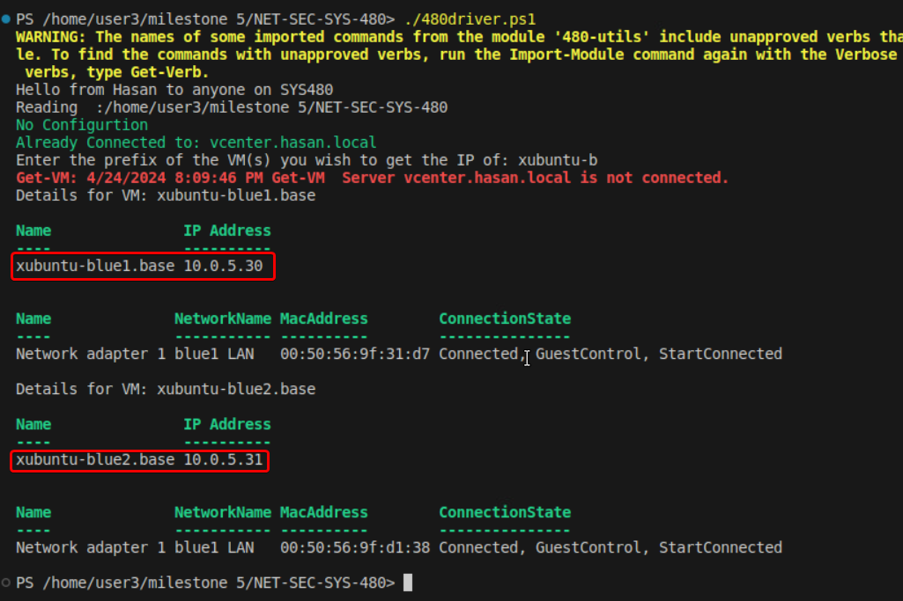
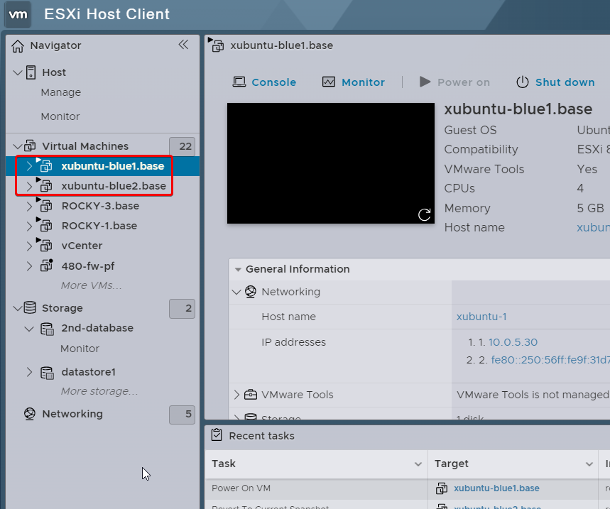
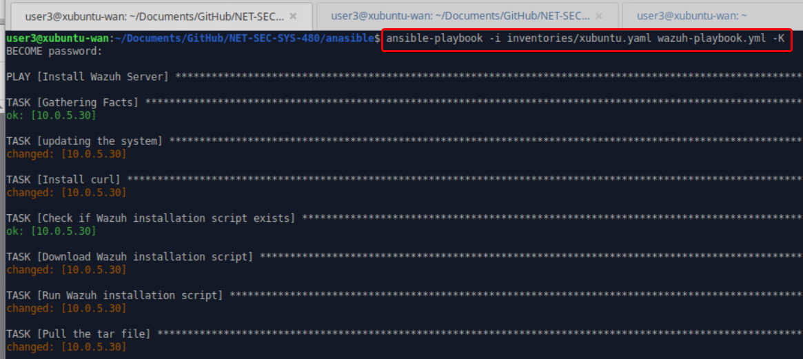
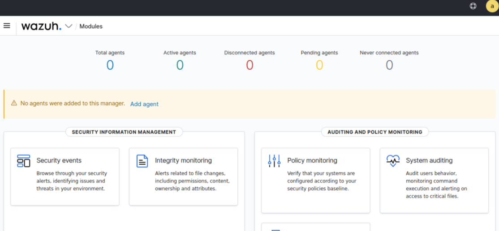
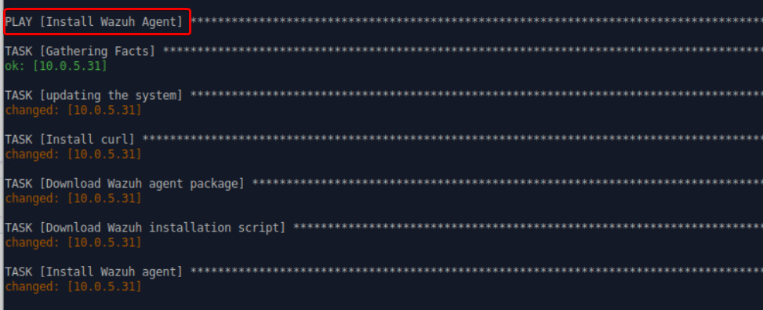
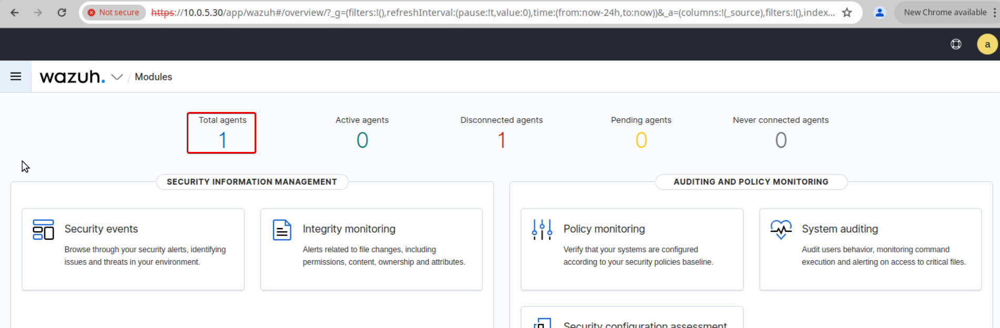
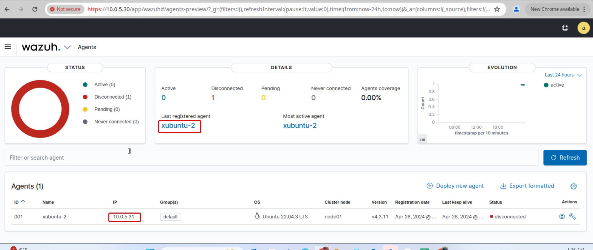

# 480 Milestone 8 - Putting the Sec in DevSecOps
💡In the demonstrations shown below, the instructor is using Splunk Enterprise as the Server and Splunk Forwarder + TA for LInux and Unix as the agent.


* Use your 480-Utils Script to deploy the Linux Server of your choice.  May need to do some post-deployment configuration (ubuntu or rocky playbook) to prep the system for ansible. Or can be included in one playbook.
*   Use Ansible to install the SIEM of your choice on the BLUE1-LAN, examples might include:  Splunk, Graylog, Wazuh, an ELK Stack, Velociraptor, FleetDM.
*   *   Note, if you are running low on resources, delete some of the rocky or linux systems created during the previous provisioning milestone.
    *   Your ansible script should install the software
*   Use Ansible to install a SIEM agent of your choice on a BLUE-LAN based system (not the SIEM).  Your goal is to install the server and agent and get the events flowing without manual intervention.
*   Demonstrate that events are flowing from the agent system to the SIEM

* [Demo Milestone Overview](https://drive.google.com/file/d/1mDI2ENnRCYpr3vk9iKACn18siTOuGr4G/view?usp=sharing)
* [Demo 8.1 - Splunk Enterprise Installation via Ansible](https://drive.google.com/file/d/1qH2I_-HCu_8c9wwD__ioWAsqi5UBfUp0/view?usp=sharing)
* [Demo 8.2 - Splunk Forwarder and Add on for Unix and Linux](https://drive.google.com/file/d/14O7xKmM2QjcxBR-sdRenkCnCEn0rBUHC/view?usp=sharing)**

## Lab Solutions

* Use your 480-Utils Script to deploy the Linux Server of your choice.  May need to do some post-deployment configuration (ubuntu or rocky playbook) to prep the system for ansible. Or can be included in one playbook.

In my case I used Xubuntu systems, the xubuntu-blue1 is the Wazuh server and the  xubuntu-blue2 will be the agent 




* Use Ansible to install the SIEM of your choice on the BLUE1-LAN, examples might include:  Splunk, Graylog, Wazuh, an ELK Stack, Velociraptor, FleetDM.
  
in this example I will be using Wazuh to learn more please vise the following link: https://wazuh.com/

This Ansible playbook is designed to facilitate the installation of the Wazuh Server on a designated host, specifically configured to target the host at 10.0.5.30. The playbook proceeds through several well-defined tasks ensuring the system is ready and the necessary components are installed. Initially, it updates the system's package list to ensure all subsequent installations fetch the latest versions. Next, it installs 'curl', a vital tool for data transfer, which is utilized later in the playbook to download the Wazuh installation script if it does not already exist in the specified directory. The playbook then checks for the presence of the Wazuh installation script in `/home/user3/Documents`; if absent, it downloads the script from the official Wazuh repository. Following the download, the playbook executes the installation script with administrative privileges. Finally, it retrieves and stores a tar file containing the Wazuh installation files from the specified directory to `/home/user3/Documents`, ensuring that all necessary files are correctly positioned and accessible for setup and configuration. This structured approach automates the installation process, making it both efficient and reproducible.

```
- name: Install Wazuh Server
  hosts: 10.0.5.30
  become: yes
  tasks:

    - name: updating the system
      ansible.builtin.shell:
        cmd: |
          sudo apt-get update

    - name: Install curl
      ansible.builtin.package:
        name: curl
        state: present

    - name: Check if Wazuh installation script exists
      ansible.builtin.stat:
        path: /home/user3/Documents/wazuh-install.sh
      register: wazuh_install_script

    - name: Download Wazuh installation script
      ansible.builtin.shell:
        cmd: |
          curl -sO https://packages.wazuh.com/4.3/wazuh-install.sh
        chdir: /home/user3/Documents
      when: not wazuh_install_script.stat.exists

    - name: Run Wazuh installation script
      ansible.builtin.shell:
        cmd: |
          sudo bash ./wazuh-install.sh -a
        chdir: /home/user3/Documents

    - name: Pull the tar file 
      ansible.builtin.fetch:
        src: /home/user3/Documents/wazuh-install-files.tar
        dest: /home/user3/Documents
      become: true
```
after running the following command you should be able to see that the wazuh server is installed successfully:
` ansible-playbook -i inventories/xubuntu.yaml wazuh-playbook.yml -K`



to check that go to your brlowser and got to the https://10.0.5.30



* Use Ansible to install a SIEM agent of your choice on a BLUE-LAN based system (not the SIEM).  Your goal is to install the server and agent and get the events flowing without manual intervention.

  To do that I created the following Ansible playbook which is tailored for the deployment of the Wazuh Agent on a specific host, identified by the IP address 10.0.5.31. The sequence of tasks within the playbook ensures a streamlined installation process, starting with a system update to ensure all packages are up-to-date. The playbook then installs 'curl', a prerequisite for fetching files over the network. Following this, it downloads the Wazuh agent Debian package directly from the official Wazuh repository to the `/home/user3/Documents` directory. Once the package is in place, the playbook executes the Wazuh installation script, specifying the Wazuh Manager IP address and the default agent group during the installation. This ensures that the agent is correctly registered and configured to communicate with the Wazuh Manager. Finally, the playbook manages the Wazuh agent service, enabling it to start at boot and immediately starting the service to ensure the agent is active and reporting to the Wazuh Manager. This configuration ensures that the agent is properly installed, enabled, and connected, providing real-time monitoring and reporting capabilities.

```
- name: Install Wazuh Agent
  hosts: 10.0.5.31
  become: yes
  tasks:
    - name: updating the system
      ansible.builtin.shell:
        cmd: |
          sudo apt-get update

    - name: Install curl
      ansible.builtin.package:
        name: curl
        state: present

    - name: Download Wazuh agent package
      ansible.builtin.shell:
        cmd: curl -so wazuh-agent-4.3.11.deb https://packages.wazuh.com/4.x/apt/pool/main/w/wazuh-agent/wazuh-agent_4.3.11-1_amd64.deb
        chdir: /home/user3/Documents

    - name: Download Wazuh installation script
      ansible.builtin.shell:
        cmd: |
          sudo WAZUH_MANAGER='10.0.5.30' WAZUH_AGENT_GROUP='default' dpkg -i ./wazuh-agent-4.3.11.deb
        chdir: /home/user3/Documents

    - name: Install Wazuh agent
      ansible.builtin.shell:
        cmd: |
          sudo systemctl daemon-reload
          sudo systemctl enable wazuh-agent
          sudo systemctl start wazuh-agent

```



  Now if you go to the browser and refresh you should see one agent been added:

  




  