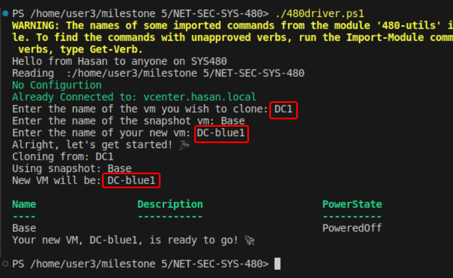
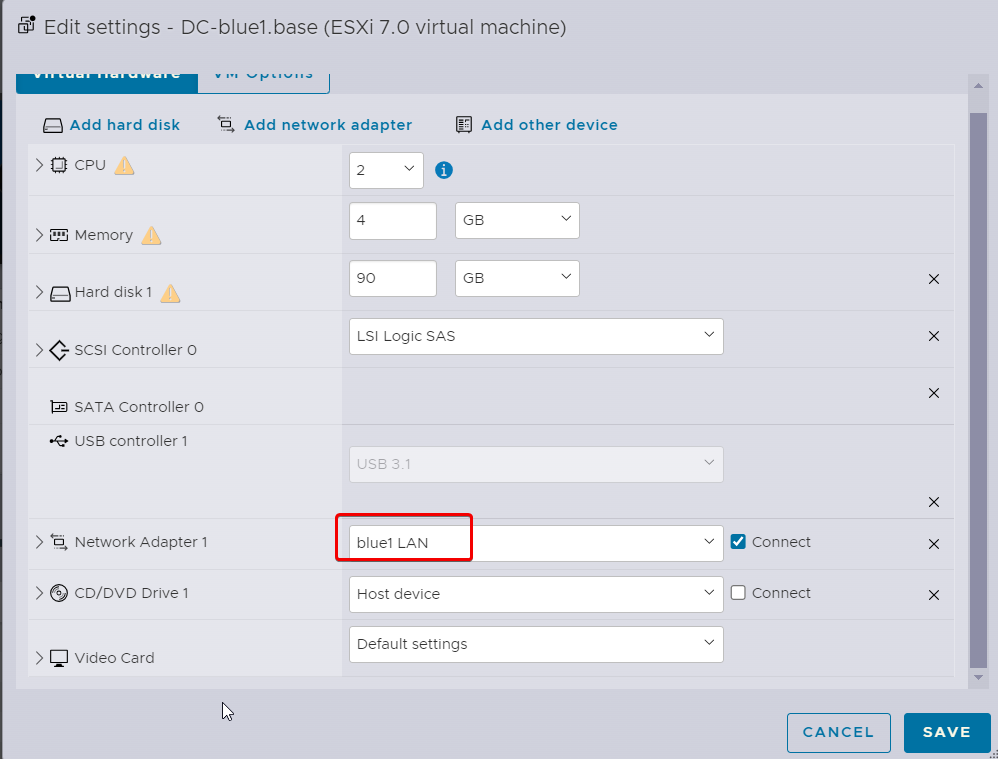
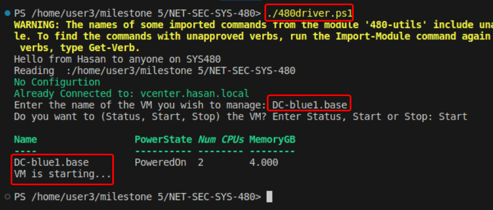
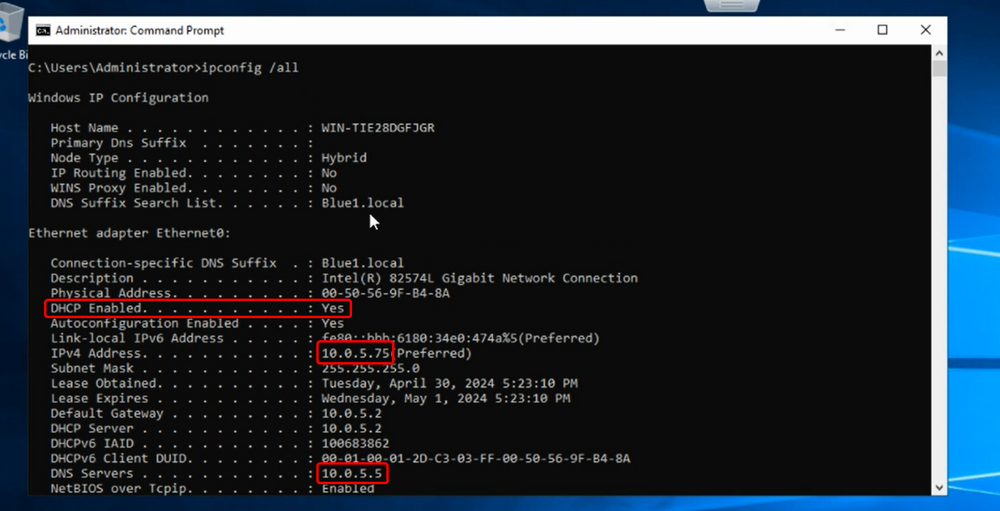
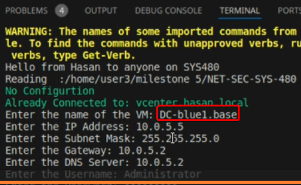
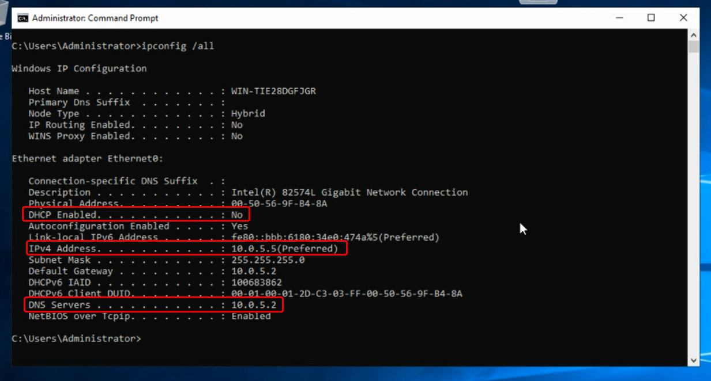
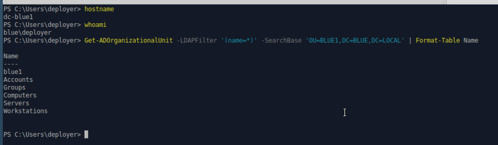

# 480 Milestone 9 - Blue1.local

## 9.1 Server Core Linked Clone

Now we need to make clone of our DC and named DC-blue1 for our blue1 network. For that we need to use the clone funcation that we have done before:



make suer to attack it to the blue1 LAN network:



Now using our funcation to mangeVM (startting our new VM):



Now if you run ipconfig /all you see that it get itis ip from the DHCP and we don't want that for our DC VM, we need to assign a static IP:



For that I have created a funcation called Set-IP, here’s a detailed overview of how this function operates:

1.  **Prompting for VM Name**: I start by asking the user to enter the name of the VM. This information is crucial to identify and select the correct VM for configuration.
2.  **VM Existence Check**: Once the VM name is provided, I attempt to fetch the VM details using `Get-VM -Name $VMName`. If no VM is found matching the provided name, I notify the user with a message indicating that the VM was not found, advising them to check the name and try again.
3.  **Gathering Network Configuration Details**: Assuming the VM exists, I then prompt the user for essential network settings: IP Address, Subnet Mask, Gateway, and DNS Server. Additionally, credentials are requested for authentication — these include a username and a password. The password is input securely, ensuring it's not visible or stored in plain text.
4.  **Password Handling**: After obtaining the password as a secure string, I convert it into plain text using the `System.Net.NetworkCredential` class. This conversion is necessary because the subsequent script execution command requires the password in plain text format.
5.  **Script Construction for Network Configuration**: With all required information in hand, I construct a script that utilizes the `netsh` command to set the new static IP address and DNS server on the specified VM’s network interface, labeled typically as "Ethernet0".
6.  **Executing the Configuration Script**: Finally, I deploy this configuration script directly into the VM using `Invoke-VMScript`. This PowerShell cmdlet executes the script within the VM, applying the new network settings using the credentials provided earlier.

```
function Set-IP {
    # Asking the user for the VM name
    $VMName = Read-Host "Enter the name of the VM"
    $VM = Get-VM -Name $VMName

   
    if ($VM -eq $null) {
        Write-Host "VM not found. Please check the name and try again."
        return
    }

    # Prompt for other necessary details
    $IPAddress = Read-Host "Enter the IP Address"
    $SubnetMask = Read-Host "Enter the Subnet Mask"
    $Gateway = Read-Host "Enter the Gateway"
    $DNSServer = Read-Host "Enter the DNS Server"
    $Username = Read-Host "Enter the Username"
    $Password = Read-Host "Enter the Password" -AsSecureString

    # Convert the SecureString password to plain text
    $PlainTextPassword = (New-Object System.Net.NetworkCredential -ArgumentList "", $Password).Password

    # Build the script to configure the network settings
    $ScriptText = @"
netsh interface ip set address name="Ethernet0" static $IPAddress $SubnetMask $Gateway 1
netsh interface ip set dnsservers "Ethernet0" static $DNSServer primary
"@

    # Execute the script inside the VM
    Invoke-VMScript -VM $VM -ScriptText $ScriptText -GuestUser $Username -GuestPassword $PlainTextPassword -ScriptType Bat
}
```
If you ran that funcation it will ask for the following:
1. Enter the name of the VM
2. Enter the IP Address
3. Enter the Gateway
4. Enter the DNS Server
5. Enter the Username
6. Enter the Password



Now if you run ipconfig /all again you will see that DHCP is disabled and the IP,gatway, and DNS are set:



## 9.2 ADDS Deployment
For this part we are going to create an Ansible Playbook to 
*   Set the local admin password
*   Set the hostname (followed by reboot)
*   Create a New Forest/Domain called something like BLUE.local (reboot)
*   Create OU structure in AD
The Ansible file could be found [Here](./DC-playbook.yml.txt)

The Ansible playbook I've documented here automates several critical tasks essential for setting up and configuring a Windows Server as a domain controller within the BLUE.local domain. Here's a breakdown of what I've achieved with this playbook:

1.  **Setting the Local Administrator Password**: I start by prompting for the local administrator password securely at runtime. This approach ensures that sensitive data isn't hard-coded into the playbook. Once obtained, this password is used to set or update the local Administrator account on the target machine.
2.  **Configuring the Hostname**: Next, I set the hostname of the server to `dc-blue1`. This ensures the server conforms to the naming conventions and requirements of our network infrastructure.
3.  **Rebooting After Configuration Changes**: To ensure all configurations take effect properly, I initiate reboots after significant changes—specifically after setting the hostname and creating the new forest and domain.
4.  **Creating a New Active Directory Forest and Domain**: I establish a new AD forest and domain named `BLUE.local`. During this task, I also set a safe mode administrator password, which is crucial for AD recovery processes.
5.  **Adding a DNS Server Forwarder**: I configure the server to use an external DNS server (`10.0.5.2`) as a forwarder. This enhances name resolution capabilities and network efficiency.
6.  **Adding a User to Domain Admins**: I add the user `deployer` to the Domain Admins group. This grants them administrative privileges across the domain, which are essential for further configuration and management tasks.
7.  **Creating Organizational Units (OUs)**: Lastly, I structure the Active Directory by creating several OUs, including `blue1`, `Accounts`, `Groups`, `Computers`, `Servers`, and `Workstations`. This hierarchical organization helps in managing policies, permissions, and resources more efficiently across the domain.


Now I ssh to the admin domain account which deployer in my case and then I ran the following command to duple check that the playbook configured everything correctly:
```
hostname
whoami
Get-ADGroupMember -Identity "Domain Admins"
Get-ADOrganizationalUnit -LDAPFilter '(name=\*)' -SearchBase 'OU=BLUE1,DC=BLUE,DC=LOCAL' | Format-Table Name

```



