# Milestone Bare Metal 1 - ESXi Setup
We are going to setup/configure the VMware ESXi, download two ISO images of the VYos and xubuntu. Here are steps that I will be taking for this lab:
<!--StartFragment-->
*   Access the server console iKVM throug the IPMI IP address that is assigne to us
*   Using the USB Stick that was given to us in the lab and boot to an ESXi8 Installer
*   Fixing the Network Management
*   Remove the IPMI interface connection
*   Adding anyother datastores (if available)
*   Building a virtual 480-WAN
*   Deploy our gateway system called 480-fw
*   Creating a 480-WAN based virtual machine (xubuntu-wan)
<!--EndFragment-->

To log in to the server you need to use the ip of the iKVM that was giving to us:

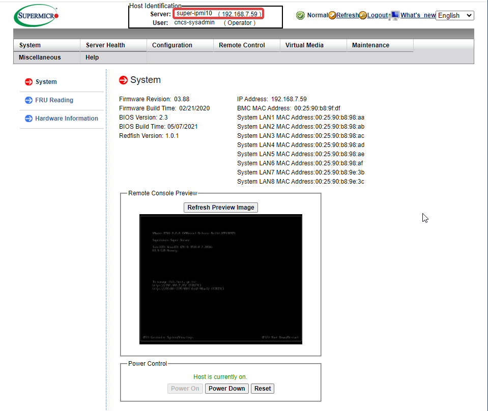

Don't forgot to plug your usb to the server that was assign to you. I went throught the configuration untill  got to the network Management page.

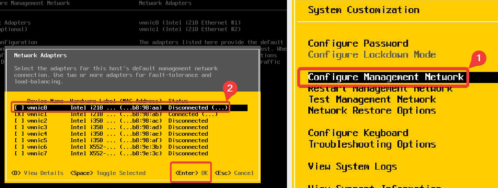

Now you need to convigure your IPv4, **User your IP not the one shown below**:

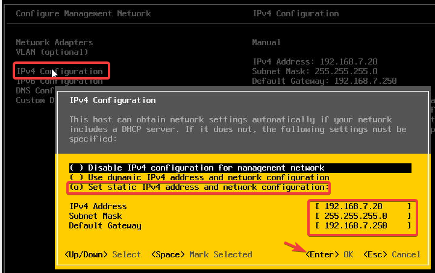

DNS Configuration:

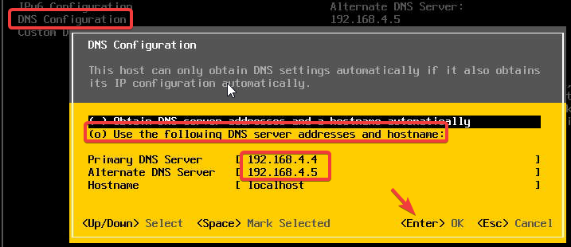

## Data Storage, ISOs, Networking
Use the vmware web Configuration to login, go to **Storage**, and add the a second datastore:

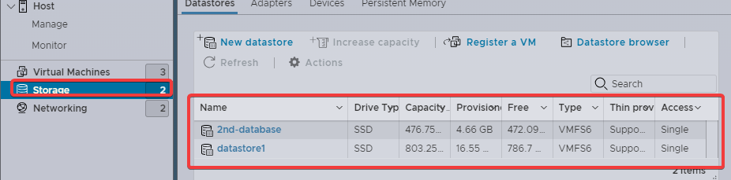

I donwnloaded Two VMs:
* vyos 1.1.8
* xubuntu 22.04.1
* PFsense (optional)
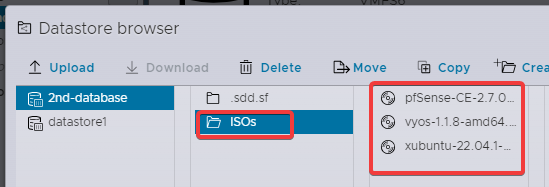

We need to create a virtul network for the VMs to make suer that our physical network is not connected to the VMs directly:

1. create a Virtual Switch in my case I called it **480-WAN**:
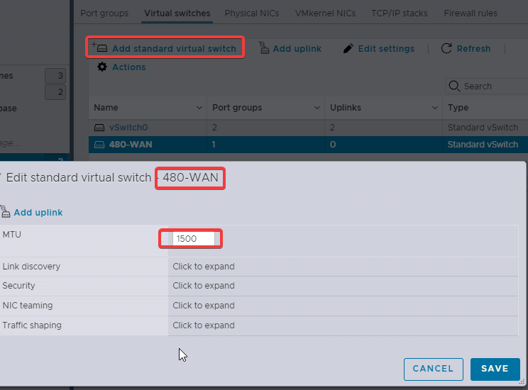
2. Create a Port Group, in my case I called it **480-WAN-Portgroup** and for Virtual Switch put the one you just created in my case **480-WAN**
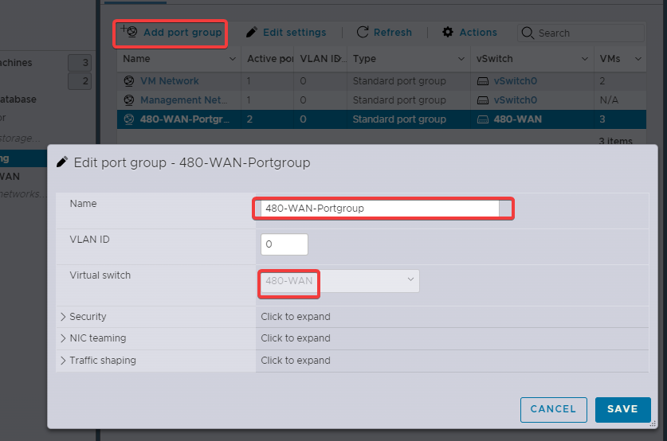

## Virtual Machines
Now we are going to build up the VMs, in our case we only have two VMs:
1. vyos (fw)
2. xubuntu (WAN)

### vyos (fw)
1. Go to Virtual Machines and click on Create/Registr VM:

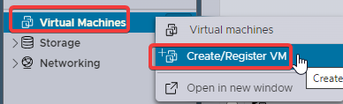

2. Create a new virtual machine --→ NEXT

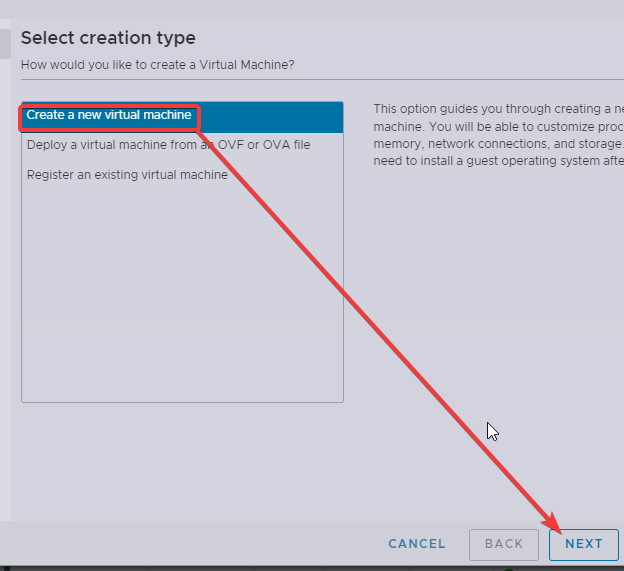

3. Name: 480-fw --→ Compatibility: ESXi 7.0… --→ Gues OS family: Linux --→ Guest OS Version: Debian...10(64-bit):

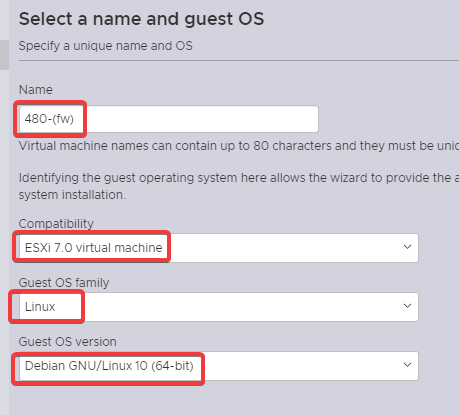

4. SELECT the datastore for this VMs:

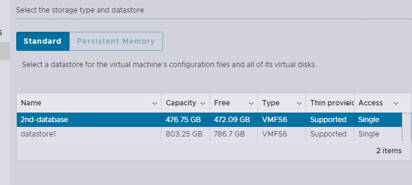

5. Here is the rest of the VM config of the vyos (fw):

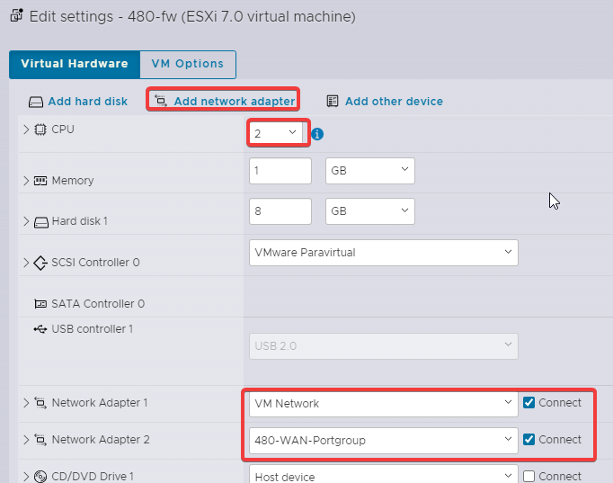

### xubuntu (WAN)
For xubuntu the steps will be the same except step 5:
In this step the it only need one netwrok adapter and some of the settings are diffent as shown below:

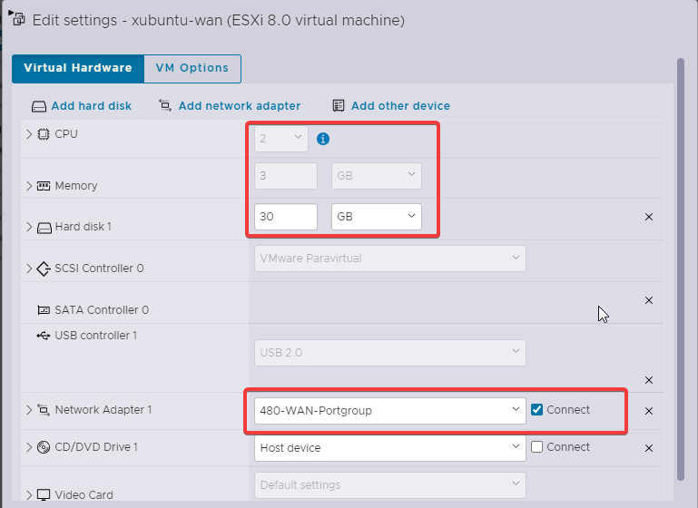

## Vyos and xubuntu configurtation
1. [vyos configuration](./vyos config)
2. xubuntu

