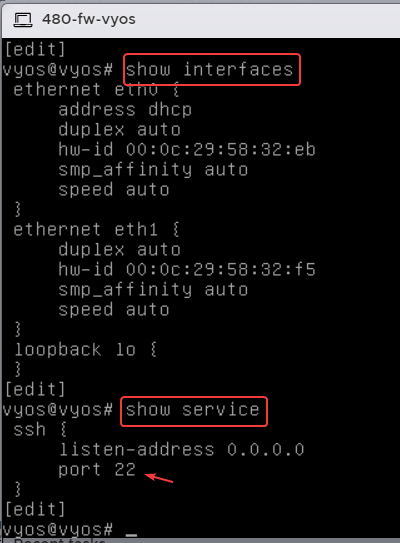
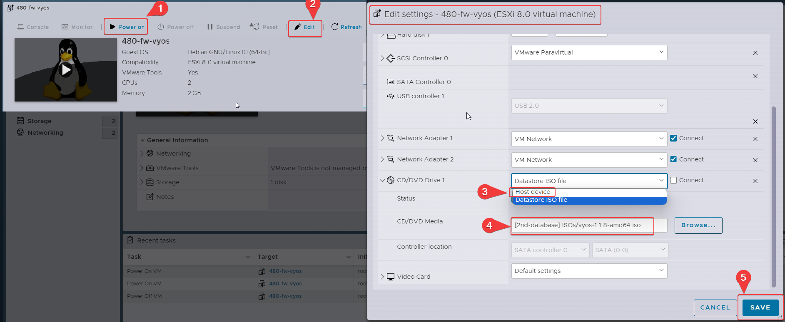
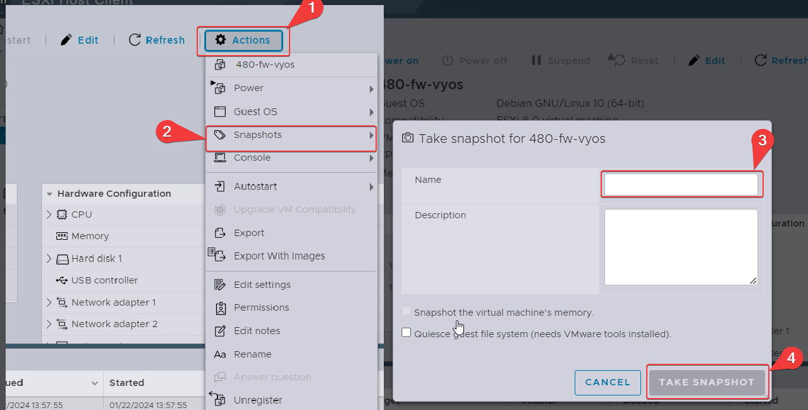
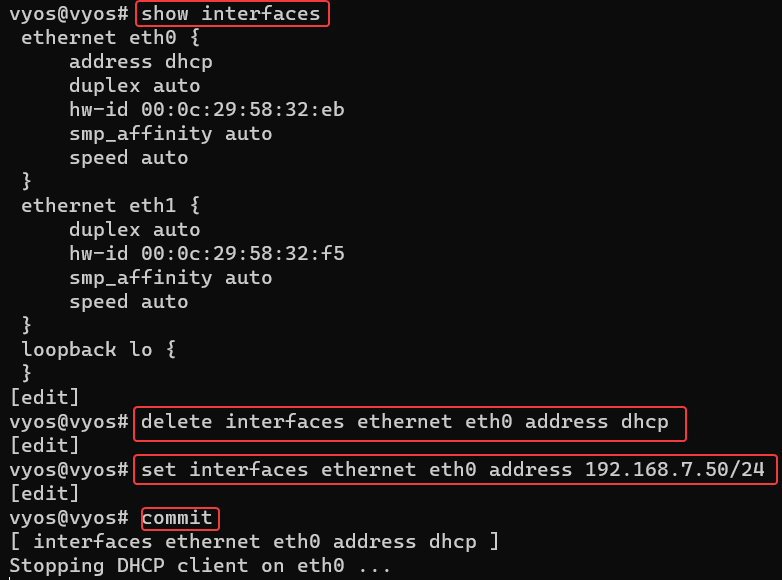
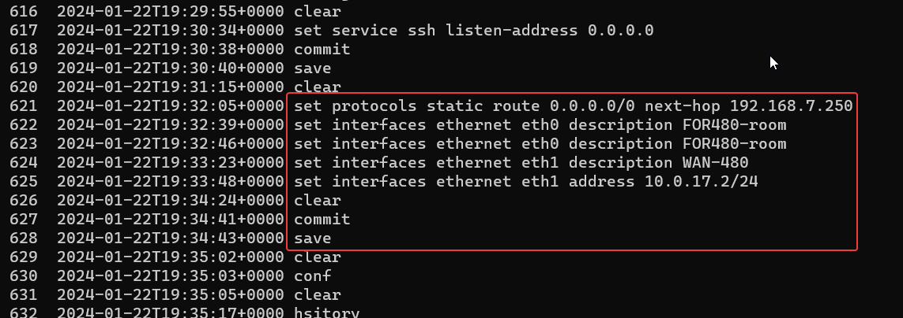
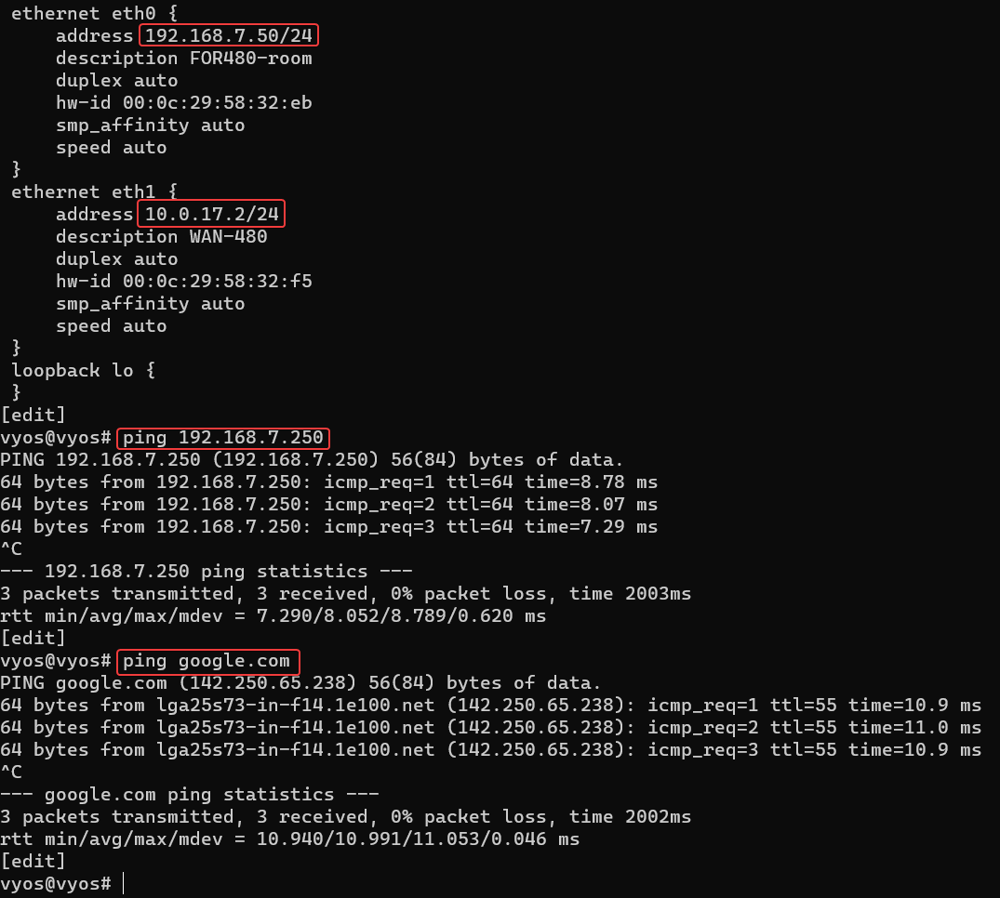

# Vyos configuration

Below are the command I ran to confgure the fw for our lab:
```
install image
configure
show interfaces
delete interfaces ethernet eth0 hw-id
delete interfaces ethernet eth1 hw-id
commit
save
show interfaces[^1]
set interfaces ethernet eth0 address dhcp
set interfaces ethernet eth1 address dhcp
set service ssh listen-addesss 0.0.0.0
commit
save
exit
poweroff,y
```

## Interfaces and services
Below is the finsished configuration:


After that we need to remove the ISO  iamge from the CD/DVD drive and I will be taking a Snapshot after: 



Now we going to ssh to it to finish up our configuration, in order to do that we need the ip address for th eth0, as shown below:


I ran the following commands to set the ip address for my eth0:
```
    show interfaces
    delete interfaces ethernet eth0 address dhcp
    set interfaces ethernet eth0 address 192.168.7.61/24
    commit
    save
```


This configuration snippet sets a static route for all traffic (0.0.0.0/0) to be forwarded to the next-hop IP address 192.168.7.250. It also assigns descriptions to two Ethernet interfaces, eth0 as "FOR480-room" and eth1 as "WAN-480," while giving eth1 the IP address 10.0.17.2 with a /24 subnet mask.
```
    set protocols static route 0.0.0.0/0 next-hop 192.168.7.250
    set interfaces ethernet eth0 description FOR480-room
    set interfaces ethernet eth1 description WAN-480
    set interfaces ethernet eth1 address 10.0.17.2/24
```



These configuration commands set up a network device named "480-fw" with two DNS servers at IP addresses 192.168.4.4 and 192.168.4.5, enable DNS forwarding on IP address 10.0.17.2, allow DNS queries from the subnet 10.0.17.0/24, and configure NAT (Network Address Translation) rules to masquerade the source addresses from the subnet 10.0.17.0/24 when traffic goes out through the "eth0" interface.
```
    set system name-server 192.168.4.4
    set system name-server 192.168.4.5
    set system host-name fw-480
    set service dns forwarding listen-address 10.0.17.2
    set service dns forwarding allow-from 10.0.17.0/24
    set service dns forwarding system
    set nat source rule 10 source address 10.0.17.0/24
    set nat source rule 10 outbound-interface eth0
    set nat source rule 10 translation address masquerade
    commit
    save
```
