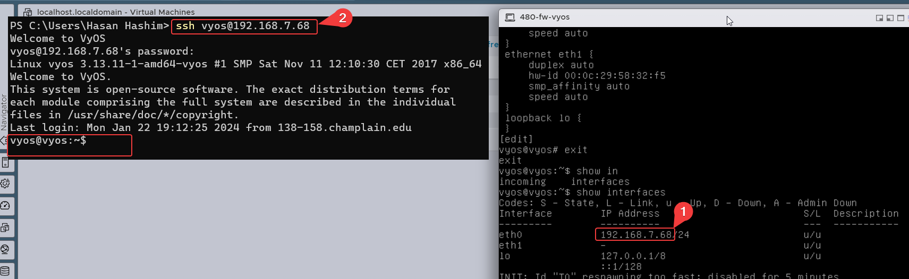

[^1]# Vyos configuration
Below are the command I ran to confgure the fw for our lab:
<<<<<<< HEAD
<!-- 
`install image
=======
<!-- -->
install image
>>>>>>> b239673350028b42e69b05ada82edc997aea7cfc
configure
show interfaces
delete interfaces ethernet eth0 hw-id
delete interfaces ethernet eth1 hw-id
commit
save
show interfaces[^1]
set interfaces ethernet eth0 address dhcp
set interfaces ethernet eth1 address dhcp
set service ssh listen-addesss 0.0.0.0
commit
save
exit
<<<<<<< HEAD
poweroff,y `
-->
=======
poweroff,y 
<!-- -->
>>>>>>> b239673350028b42e69b05ada82edc997aea7cfc

## Interfaces and services
Below is the finsished configuration:

After that we need to remove the ISO  iamge from the CD/DVD drive and I will be taking a Snapshot after: 

Now we going to ssh to it to finish up our configuration, in order to do that we need the ip address for th eth0, as shown below:

I ran the following commands to set the ip address for my eth0:
<!--
    show interfaces
    delete interfaces ethernet eth0 address dhcp
    set interfaces ethernet eth0 address 192.168.7.61/24
    commit
    save
-->

<!--
    set protocols static route 0.0.0.0/0 next-hop 192.168.7.250[^1]
    set interfaces ethernet eth0 description CYBERLAB
    set interfaces ethernet eth1 description 480-WAN
    set interfaces ethernet eth1 address 10.0.17.2/24
-->

[^1]: 
[^1]: 
[^1]: 
