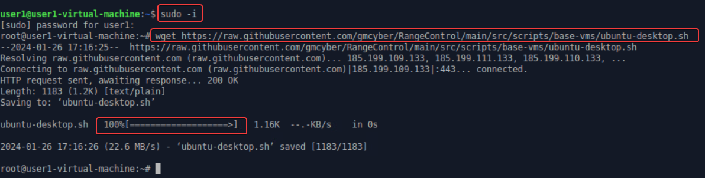
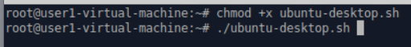
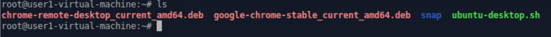
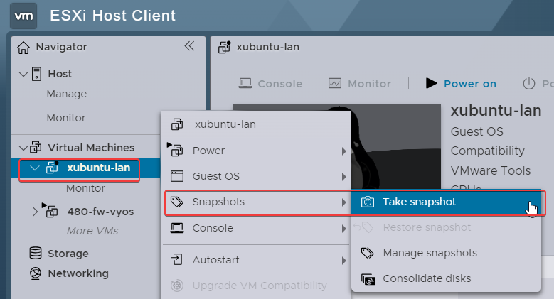
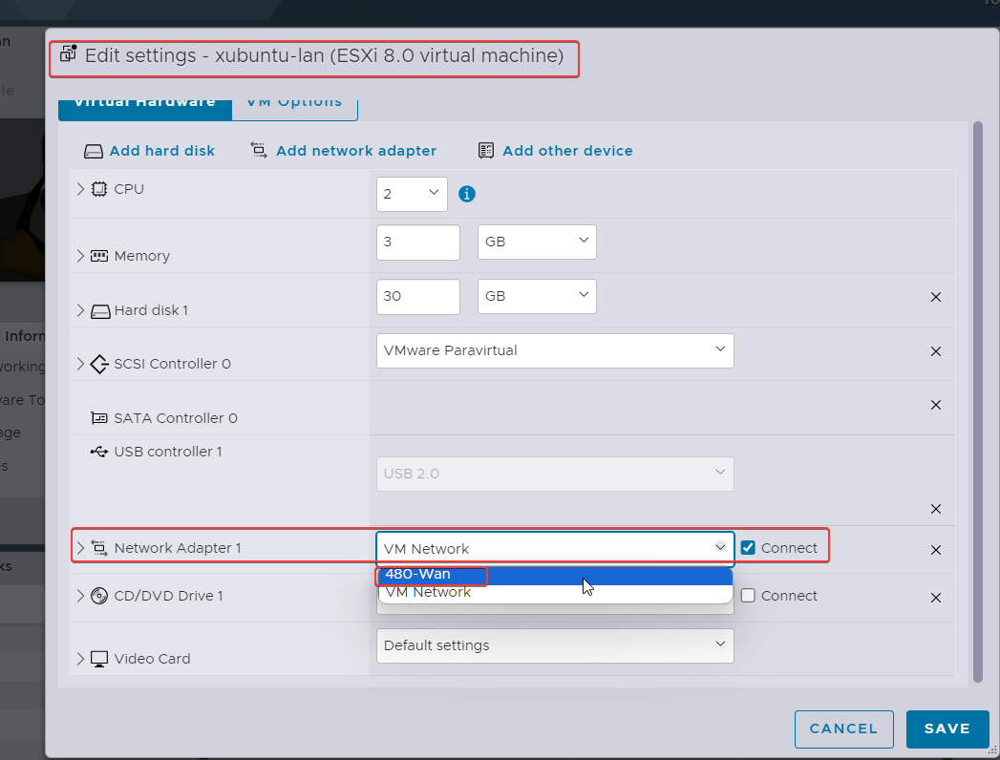
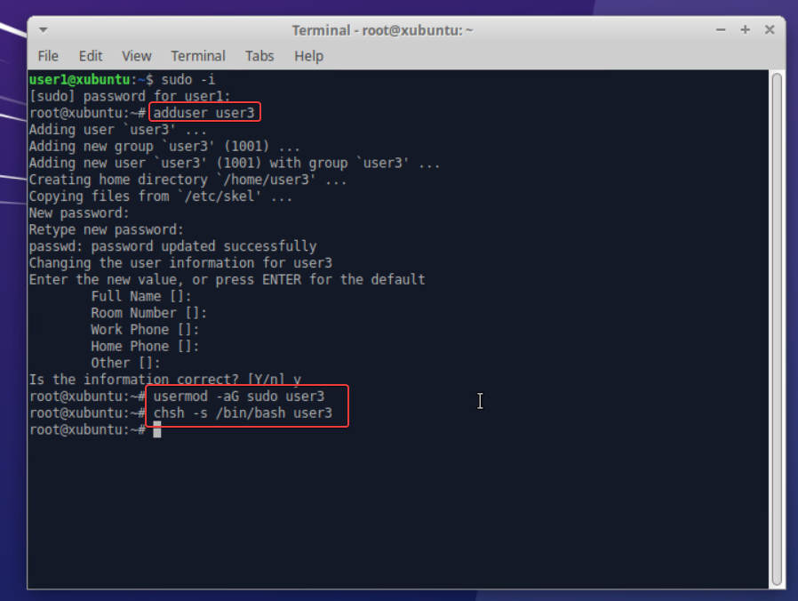
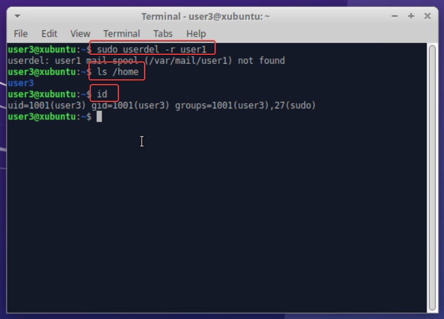
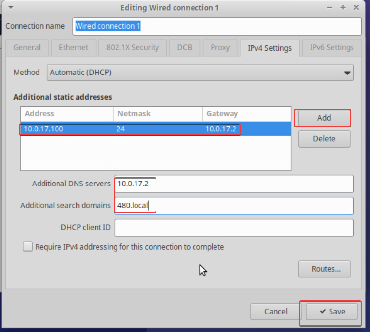
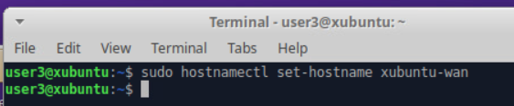

# Creating an xubuntu-wan
First I logged in to the ubuntu machine and ran the script that was created by gmcyber: https://raw.githubusercontent.com/gmcyber/RangeControl/main/src/scripts/base-vms/ubuntu-desktop.sh
now open the terminal and run the following commands:
```
sudo -i
wget https://raw.githubusercontent.com/gmcyber/RangeControl/main/src/scripts/base-vms/ubuntu-desktop.sh
```

```
chmod +x ubuntu-desktop.sh
./ubuntu-desktop.sh
ls
```


Taking snapshot:

now, in xubuntu-wan, click on edit, go to network adapter 1, change it to 480-WAN, lick on save, and finally power it on:

```
sudo -i
adduser user3
usermod -aG sudo user3
chsh -s /bin/bash user3
```

Now logged in as user3 and deleted user 1:
```
userdel -r user1
ls /home
id
```

Now we need to assign it an static ip in order to get connection:

```
sudo hostnamesctl set-hostname xubuntu-wan
```



