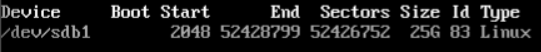
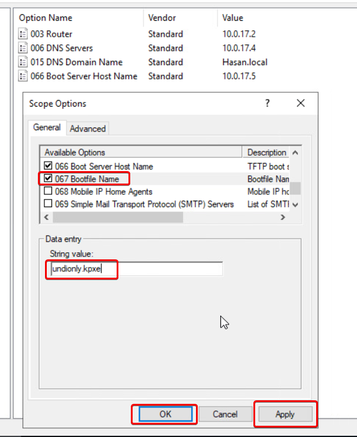

# Milestone X - FOG

For this project I used one of the Rocky VMs that I had. I edited it by adding the second Hard 
You can also donwload the ISO Rocky from here: [Rocky ISO](https://rockylinux.org/download/)


You need to set you hostname to fog and static IP of 10.0.17.5. if you don't know how to do that here are the command: ` sudo nmtui` and then click on Set system … and set you hostname:


After you done from the hostname click on Edit a connection to set up static IP and disable IPV6. After that reboot the system and you see everything is configured:


#### Fog Installation Tasks
Now we are going to mount the second drive using the following command:
`fdisk -l` to see the drives that you have in the system. `/dev/sdb` is the unpartitioned disk. 


To use that drive we need to mount it, to do that we need to use the following commands:
```
fdisk /dev/sdb
Next it will ask you to wire the partition.
`w`
fdisk -l
```



Now we going to create the ext4 file system:


we need to have git installed to clone the Fog project from the github: 
```
yum install git
git clone https://github.com/FOGProject/fogproject.git
```
After that go /fogproject/bin/ and run the installfog.sh:
* Follow Devin's video: [Video 5.2](https://drive.google.com/file/d/1iL0guYnOPxmIChsfxkMSZIFyU02XcxWC/view?usp=sharing)
* or follow this link: https://www.ceos3c.com/linux/install-fog-server-ubuntu-server/
  


When it is done it will give you username and password to login using GUI web based:


Now when you login I advise you to change you password, as shown below:


Make suer to add the following into your DHCP server:




Now we have to create an image to tell FOG to get ready to capuer the image: 


Using my cloner script I made two clone one is the base and the other is used to get the image:


Make suer you have the following boot order:


Now go to Quick Registration and Inventory:


Now go to the fog web based and click on hosts → List All Hosts → caputer


Slecte xubuntu-20-02 - (2)


Now you should see this which means we are at the right path to captuer the image:


Now create a new VM and powered on. you will see this which a really good sign, click on Deply Image:


Now it will ask you login with you account:


After that select the image you want to use in my case I only have one which is xubuntu:


After a while you should be able to see your VM booting up with your image:


