# Milestone 7 - Deploying and Post Provisioning of BlueX Linux Servers

💡In this module, we will be deploying 5 linux servers directly to a DHCP enabled BlueX LAN:(3 Rocky Linux and 2 Ubuntu).  Network configuration on FW-Blue1 will be adjusted similarly to the way we provision vyos.  We will then adjust the networking configuration on 5 linux hosts.

10.0.5.5 may be used in some of these demos/configs - we haven’t set that up yet
## 7.1 Create a Rocky 9.1 Base VM
Create a Rocky Linux 9.1 Base VM from the minimal.iso file shown below, you should have enough information to make this happen.  Make sure it is thin provisioned.  The following [script](https://raw.githubusercontent.com/gmcyber/RangeControl/main/src/scripts/base-vms/rhel-sealer.sh) can be run to prepare the virtual machine.

**
## 7.2 DHCP Services on fw-blue1 and a static (or dynamic) route on 480-fw
*   Create a static route on 480-fw such that 480-WAN traffic destined to the BLUE network IP space (10.0.5.0/24) is routed to the fw-blue1's eth0 interface
*   *   You can just console/ssh into 480-FW to create the static rule- no need to get fancy!
*   Using an ansible playbook, create the DHCP pool on fw-blue1
*   *   Couple of tasks:
    *   *   Inventory file: Using .yml instead of txt for the inventory file.  Just a different way to store the variables for the playbook and is a bit more scalable than .txt**

***   Playbook file: For this milestone, you will use the ansible vyos modules to write commands to fw-blue1.  (as opposed to the the last milestone where we replaced the config file)
*   *   To have ansible run vyos commands (e.g. something like “show version” can use the ansible [vyos\_command module](https://docs.ansible.com/ansible/latest/collections/vyos/vyos/vyos_command_module.html#ansible-collections-vyos-vyos-vyos-command-module) for relevant tasks
    *   To have ansible add/remove “lines” from the vyos configuration, can use the ansible [vyos\_config module](https://docs.ansible.com/ansible/latest/collections/vyos/vyos/vyos_config_module.html)
*   Tips: Here is an example of a DHCP server config for vyos - just to save you some time from looking up the commands
*   *   BLUE1 is the name given to the network just to help with the configurationservice {     dhcp-server {         global-parameters "local-address 10.0.5.2"         shared-network-name BLUE1 {             authoritative             subnet 10.0.5.0/24 {                 default-router 10.0.5.2                 domain-name blue1.local                 lease 86400                 name-server 10.0.5.5                 range BLUE1--POOL {                     start 10.0.5.75                     stop 10.0.5.125                 }             }         }     }*   So, you should be able to figure out the command for each line, e.g.set service dhcp-server shared-network-name BLUE1 subnet 10.0.5.0/24 lease 86400*   Demonstration [video](https://drive.google.com/file/d/16QN_pd2rrV74KRyWNKC_vKtoY1qEoiMB/view?usp=sharing)
*   Using your version of 480-utils, create 3 rocky linked clones that land on the BLUE network, picking up a DHCP address.
*   Demonstration [video](https://drive.google.com/file/d/1RNTUu_Q8oMyByCox28Hg1iCUROOlb4vO/view?usp=sharing)**

## 7.3 Post Provisioning Rocky-1-3 with Ansible
*   Your ansible playbook should do the following:
*   *   add a public key for the deployer user
    *   create a sudoers drop-in file for no password elevation to root by deployer
    *   change the hostname
    *   change the dhcp ip address to static (10.0.5.10,11,12)Demonstration [video](https://drive.google.com/file/d/1KwNME-Vji3SvGrjl3CP8-dHzcFQDTCjP/view?usp=sharing)**

## 7.4  Post Provisioning Ubuntu 1-2 with Ansible
Repeat the 7.3 requirements with ubuntu.
 Deliverable 3.  Video demonstration showing successful ansible run for post provisioning of Ubuntu 1-2.  Walk through your playbook and inventory file for this part of the deliverable.  Use static IP addresses of 10.0.5.30 and 10.0.5.31 for Ubuntu 1 and 2 respectively.**


# Lab Solutions
Download the Rock iso image from the following link:
https://dl.rockylinux.org/vault/rocky/9.1/isos/x86_64/

Now we have ot create a new VM for the Rocky: 

*   Click on virtual machines on the navigator menu image
*  Select a name and gues OS - in my case I named it "Rocky"

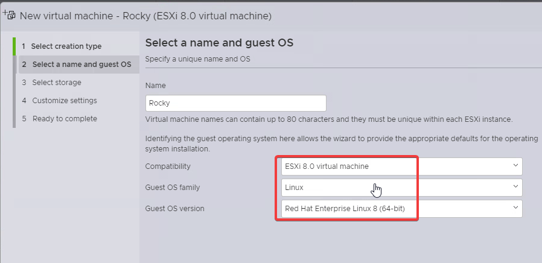

*   Select storage image:
*   Default settings 4.Customize settings
*   Hard disk: open drop down
    *   Disk provisioning: **Thin provisioned**
*   Network Adapter 1: 480-WAN-PortGroup
*   CD/DVD Drive: Datastore ISO file
    *   You will be brought back to the isos file, select the ISO image where you downloaded

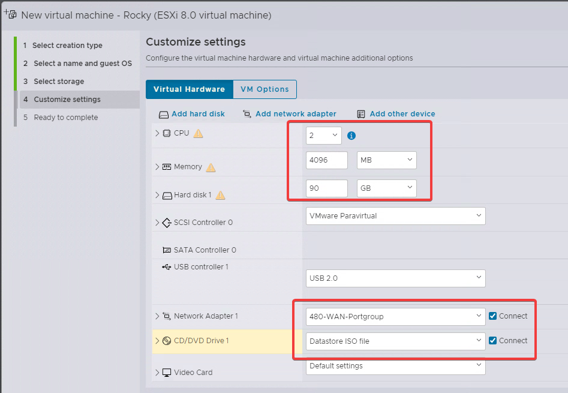

Run the following command to get install the screpts form gmcyber github and run it and it is done turn off and take a snapshot called Base:
```
wget https://raw.githubusercontent.com/gmcyber/RangeControl/main/src/scripts/base-vms/rhel-sealer.sh
chmod +x rhel-sealer.sh
./rhel-sealer.sh
```
Before you take the snapshot remove the iso form the cd then take the snapshot:

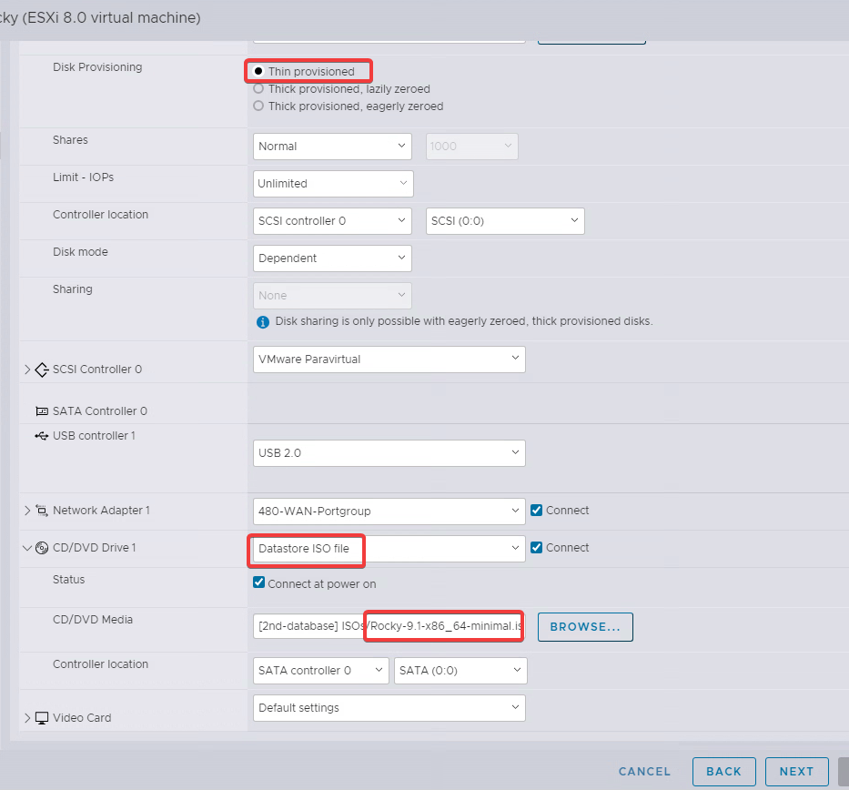

Finish up the setup as shown below:

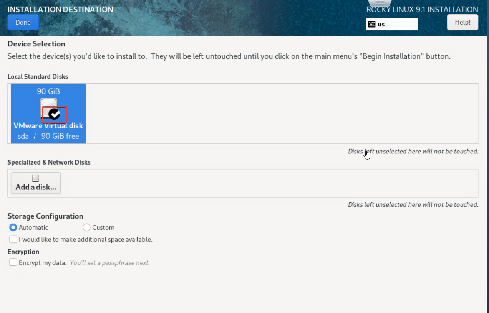
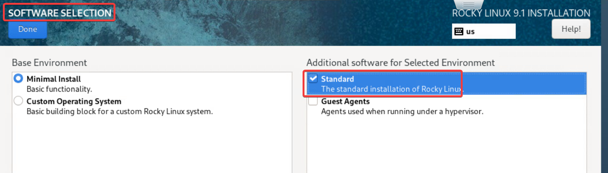
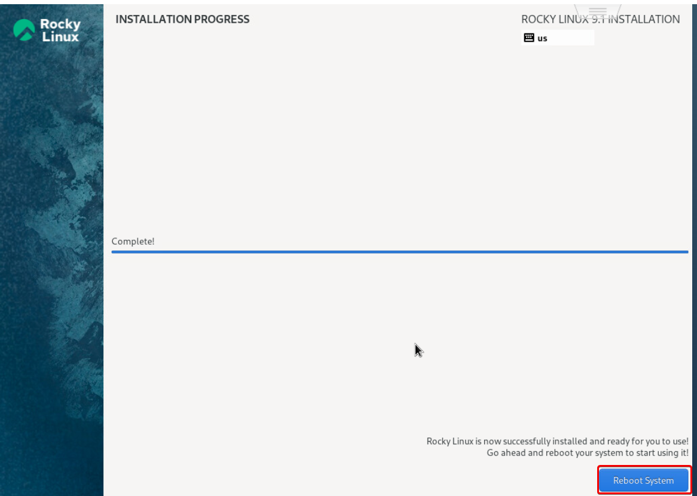

Now remove the ISO file and take a snapshot 

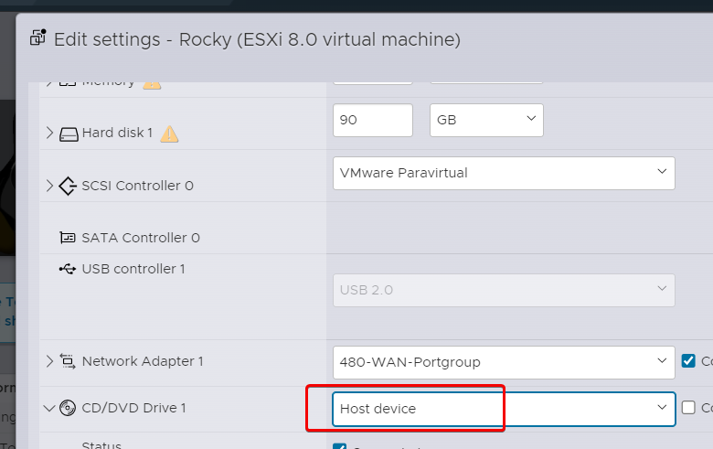
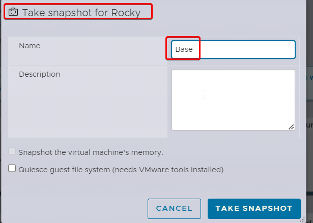
## 7.2 DHCP Services on fw-blue1 and a static (or dynamic) route on 480-fw

on the pf sense firewall start the shell by using the option "8" and type the command below:
```
route add -net 10.0.5.0/24 10.0.17.200
netstat -r
```
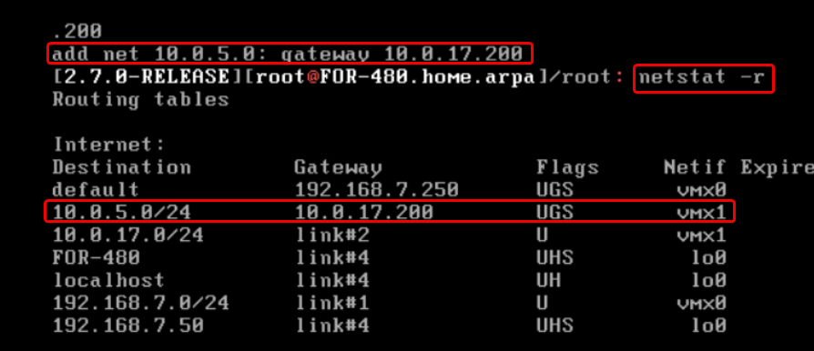

Do the following in the fw-blue1 (vyos)

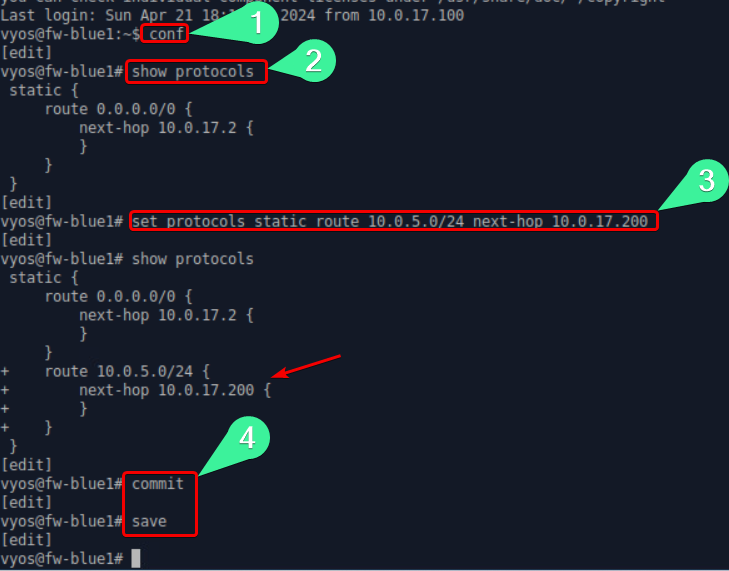

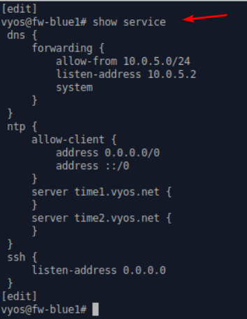

Create a file called fw-blue1-vars.yaml and add the following in it:

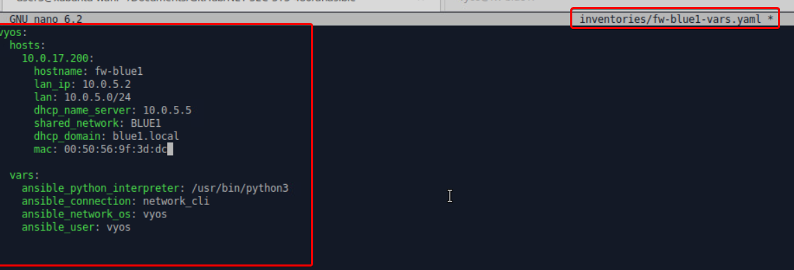

Run the following command `ansible-playbook -i inventories/fw-blue1-vars.yaml --ask-pass vyos-blue.yml` to run the asnible and setup the dhcp server:

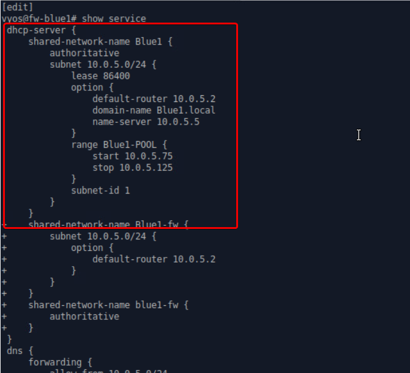

After that create three rocky clone and asing them to the blue1-lan network to test the dhcp server. after run the GET-IP to list the ip address of the Rocky to see the dhcp ip addresses:

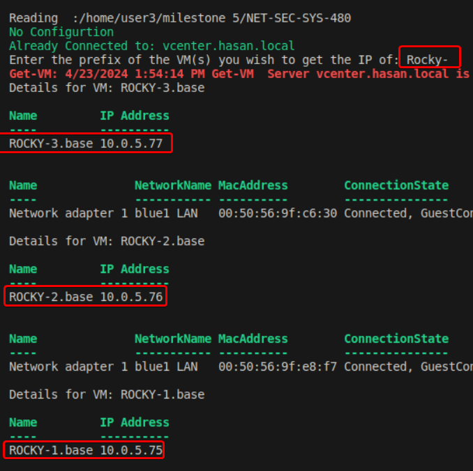

## 7.3 Post Provisioning Rocky-1-3 with Ansible
*   Your ansible playbook should do the following:
*   *   add a public key for the deployer user
    *   create a sudoers drop-in file for no password elevation to root by deployer
    *   change the hostname
    *   change the dhcp ip address to static (10.0.5.10,11,12)Demonstration [video](https://drive.google.com/file/d/1KwNME-Vji3SvGrjl3CP8-dHzcFQDTCjP/view?usp=sharing)**
Here is the rocky-playbook.yml file:
```
# This is for Milestone 7.3
- name: rocky config
  hosts: rocky
  tasks:
  - name: Create the .ssh directory if it is not there
    file:
      path: "/home/{{ ansible_user }}/.ssh"
      state: directory
      mode: 0700
  - name: Create authorized_keys file
    file:
      path: "/home/{{ ansible_user }}/.ssh/authorized_keys"
      state: touch
      mode: 0644
  - name: Copy over key block and append to authorized_keys
    blockinfile:
      dest: "/home/{{ ansible_user }}/.ssh/authorized_keys"
      block: "{{ public_key }}"

  - name: Create sudoers drop in file for 480
    file:
      path: /etc/sudoers.d/480
      state: touch
      mode: 0400
    become: yes

  - name: Create a drop in entry in /etc/sudoers.d/480
    blockinfile:
      dest: /etc/sudoers.d/480
      block: "{{ ansible_user }} ALL=(ALL) NOPASSWD: ALL"
    become: yes

  - name: Set the hostname
    hostname:
      name: "{{ hostname }}"
    become: yes
  
  - name: Add host to hosts file
    lineinfile:
      path: /etc/hosts
      line: '127.0.1.1 {{ hostname }}'
    become: yes

  - name: run nmcli
    nmcli:
      conn_name: "{{device}}"
      ip4: "{{lan_ip}}/24"
      gw4: "{{gateway}}"
      state: present
      type: ethernet
      dns4:
        - "{{name_server}}"
        - "{{gateway}}"
      method4: manual
    become: yes

  - name: bounce the box
    shell: "sleep 5 && shutdown -r"
    become: yes
    async: 1
    poll: 0
  

```
Here is the linux.yaml file:
```
# This is for Milestone 7.3
linux:
  hosts:
  children:
    rocky:
      hosts:
        10.0.5.75:
          hostname: rocky-1
          lan_ip: 10.0.5.10
        10.0.5.76:
          hostname: rocky-2
          lan_ip: 10.0.5.11
        10.0.5.77:
          hostname: rocky-3
          lan_ip: 10.0.5.12
      vars:
        device: ens34

  vars:
    public_key: "output from the `cat id_rsa.pub` goes here"
    ansible_user: hasan
    prefix: 24
    gateway: 10.0.5.2
    name_server: 10.0.5.5
    domain: blue1.local
    
```

Now  run the following command to genrate the ssh public key:
```
cd /user3/.ssh
ssh-keygen
cat id_rsa.pub
```
copy the output from the cat and save it in the linux.yaml file. After everything is done run the following command to run the ansible playbook:
`ansible-playbook -i inventories/linux.yaml --ask-pass rocky-playbook.yml -K`

Now the ip address should be set statically:

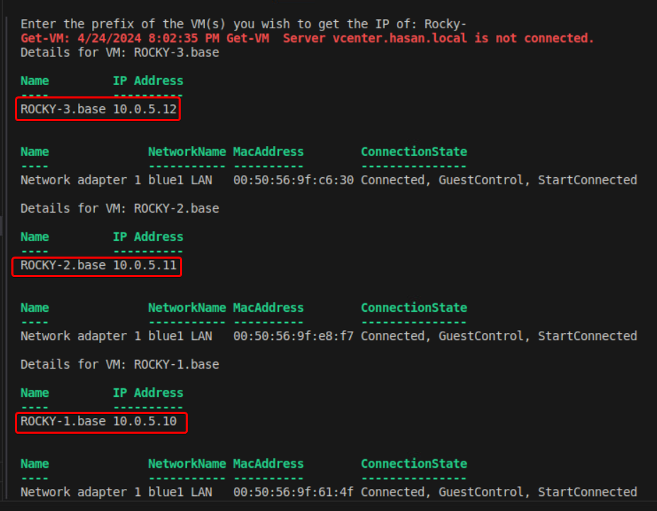

```
# This is for Milestone 7.3
- name: rocky config
  hosts: rocky
  tasks:
  - name: Create the .ssh directory if it is not there
    file:
      path: "/home/{{ ansible_user }}/.ssh"
      state: directory
      mode: 0700
  - name: Create authorized_keys file
    file:
      path: "/home/{{ ansible_user }}/.ssh/authorized_keys"
      state: touch
      mode: 0644
  - name: Copy over key block and append to authorized_keys
    blockinfile:
      dest: "/home/{{ ansible_user }}/.ssh/authorized_keys"
      block: "{{ public_key }}"

  - name: Create sudoers drop in file for 480
    file:
      path: /etc/sudoers.d/480
      state: touch
      mode: 0400
    become: yes

  - name: Create a drop in entry in /etc/sudoers.d/480
    blockinfile:
      dest: /etc/sudoers.d/480
      block: "{{ ansible_user }} ALL=(ALL) NOPASSWD: ALL"
    become: yes

  - name: Set the hostname
    hostname:
      name: "{{ hostname }}"
    become: yes
  
  - name: Add host to hosts file
    lineinfile:
      path: /etc/hosts
      line: '127.0.1.1 {{ hostname }}'
    become: yes

  - name: run nmcli
    nmcli:
      conn_name: "{{device}}"
      ip4: "{{lan_ip}}/24"
      gw4: "{{gateway}}"
      state: present
      type: ethernet
      dns4:
        - "{{name_server}}"
        - "{{gateway}}"
      method4: manual
    become: yes

  - name: bounce the box
    shell: "sleep 5 && shutdown -r"
    become: yes
    async: 1
    poll: 0
  

```

## 7.4  Post Provisioning Ubuntu 1-2 with Ansible
* Repeat the 7.3 requirements with ubuntu.
 * Deliverable 3.  Video demonstration showing successful ansible run for post provisioning of Ubuntu 1-2.  Walk through your playbook and inventory file for this part of the deliverable.  Use static IP addresses of 10.0.5.30 and 10.0.5.31 for Ubuntu 1 and 2 respectively.

Clone your xubuntu VMs into 2 clones and name them xubuntu-blue1 and xubuntu-blue2.

Create a new inventorie file called xubuntu.yaml and a new playbook file called xubuntu-playbook.yml and run the following command to run the ansible for the two xubuntu hosts: 
`ansible-playbook -i inventories/xubuntu.yaml --ask-pass xubuntu-playbook.yml -K`

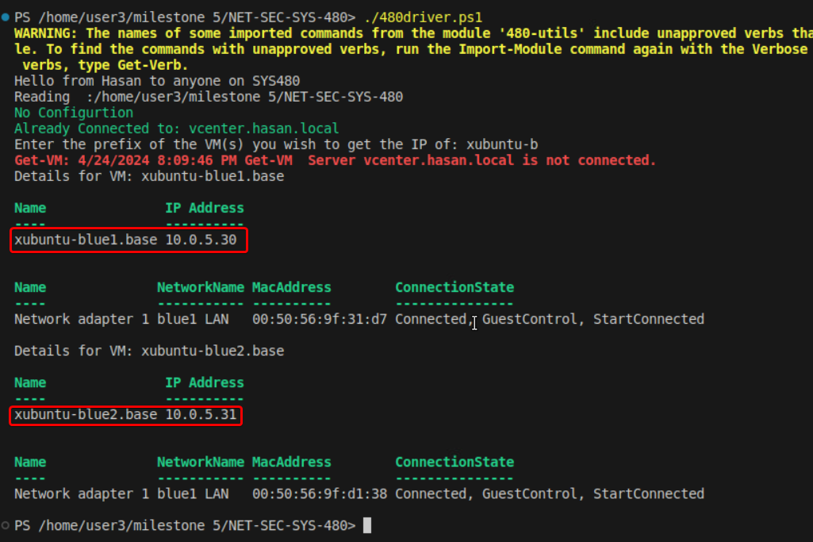


